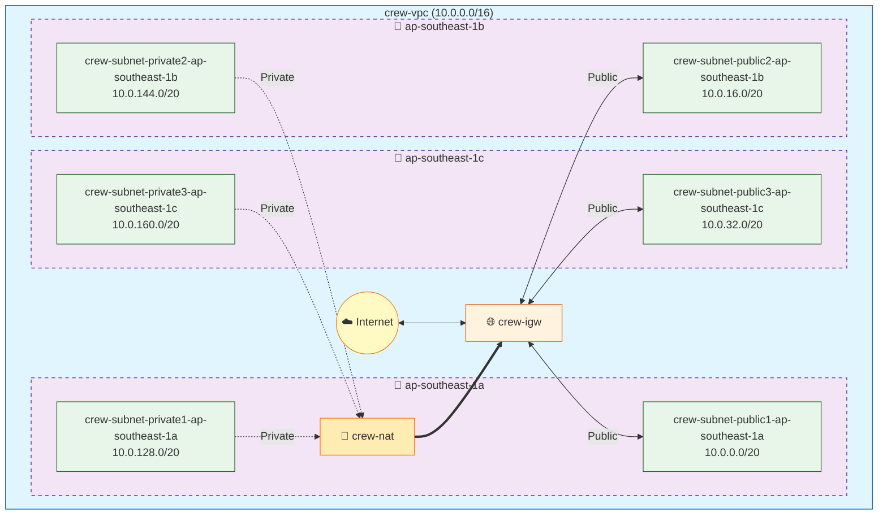

# Blueprint: aws-resource

## 📑 목차

```table-of-contents

```

## Network (crew-vpc · vpc-0d54f35e4a68cbf10)

| 항목         | 값                                |
| :--------- | :------------------------------- |
| 이름         | crew-vpc · vpc-0d54f35e4a68cbf10 |
| CIDR       | 10.0.0.0/16                      |
| DNS 지원     | true                             |
| DNS 호스트 이름 | true                             |

### 서브넷

| 이름                                   | CIDR          | AZ              | 상태        |
| :----------------------------------- | :------------ | :-------------- | :-------- |
| crew-subnet-public3-ap-southeast-1c  | 10.0.32.0/20  | ap-southeast-1c | available |
| crew-subnet-private3-ap-southeast-1c | 10.0.160.0/20 | ap-southeast-1c | available |
| crew-subnet-public1-ap-southeast-1a  | 10.0.0.0/20   | ap-southeast-1a | available |
| crew-subnet-public2-ap-southeast-1b  | 10.0.16.0/20  | ap-southeast-1b | available |
| crew-subnet-private2-ap-southeast-1b | 10.0.144.0/20 | ap-southeast-1b | available |
| crew-subnet-private1-ap-southeast-1a | 10.0.128.0/20 | ap-southeast-1a | available |

### 인터넷 게이트웨이

| 이름 | 연결된 VPC |
|:---|:---|
| crew-igw · igw-0cd1b0b4bc37be29d | crew-vpc · vpc-0d54f35e4a68cbf10 |

### NAT 게이트웨이

#### crew-nat · nat-0063933f157c4e600
| 항목 | 값 |
|:---|:---|
| 이름 | crew-nat · nat-0063933f157c4e600 |
| 가용성 모드 | 영역 |
| 서브넷 | crew-subnet-public1-ap-southeast-1a · subnet-06b40630a1d6dd4dd |
| 연결 유형 | 퍼블릭 |
| 탄력적 IP 할당 ID | `eipalloc-0c060ef1dd8e421c3` |

### 라우팅 테이블

#### crew-rtb-public · rtb-06bd1ec14278812cf

| 대상 | 대상 | 상태 |
|:---|:---|:---|
| 10.0.0.0/16 | local | active |
| 0.0.0.0/0 | igw-0cd1b0b4bc37be29d | active |

**연결된 서브넷:**

| 서브넷 |
|:---|
| crew-subnet-public3-ap-southeast-1c (subnet-077d42a99f13b36dd) |
| crew-subnet-public1-ap-southeast-1a (subnet-06b40630a1d6dd4dd) |
| crew-subnet-public2-ap-southeast-1b (subnet-07313b0aa9e62f50f) |

#### crew-rtb-private2-ap-southeast-1b · rtb-068892e2a1e5c0a95

| 대상 | 대상 | 상태 |
|:---|:---|:---|
| 10.0.0.0/16 | local | active |
| 0.0.0.0/0 | nat-0063933f157c4e600 | active |

**연결된 서브넷:**

| 서브넷 |
|:---|
| crew-subnet-private2-ap-southeast-1b (subnet-0742fe691a63a84b2) |

#### crew-rtb-private3-ap-southeast-1c · rtb-0aadb2d3da7ea1a35

| 대상 | 대상 | 상태 |
|:---|:---|:---|
| 10.0.0.0/16 | local | active |
| 0.0.0.0/0 | nat-0063933f157c4e600 | active |

**연결된 서브넷:**

| 서브넷 |
|:---|
| crew-subnet-private3-ap-southeast-1c (subnet-00ba5f74b7bf7c68e) |

#### crew-rtb-private1-ap-southeast-1a · rtb-0947a8f2edcab1f63

| 대상 | 대상 | 상태 |
|:---|:---|:---|
| 10.0.0.0/16 | local | active |
| 0.0.0.0/0 | nat-0063933f157c4e600 | active |

**연결된 서브넷:**

| 서브넷 |
|:---|
| crew-subnet-private1-ap-southeast-1a (subnet-06c6ffd7f897a4fb0) |

#### NULL · rtb-0562dd5cd7110a932

| 대상 | 대상 | 상태 |
|:---|:---|:---|
| 10.0.0.0/16 | local | active |

### Elastic IPs

| 이름 | Public IP | 연결 |
|:---|:---|:---|
| 13.250.203.56 | 13.250.203.56 | Private IP: 10.0.6.149 |
| 13.251.98.12 | 13.251.98.12 | Private IP: 10.0.14.170 |
| 52.221.38.209 | 52.221.38.209 | Private IP: 10.0.44.118 |
| 52.74.94.114 | 52.74.94.114 | - |

### 네트워크 구성도




---

## Security Group (ec2 · sg-07a1c253f1a6c3a00)

| 항목 | 값 |
|:---|:---|
| 이름 | ec2 · sg-07a1c253f1a6c3a00 |
| 설명 | launch-wizard-1 created 2026-02-03T03:14:36.688Z |
| VPC ID | vpc-0d54f35e4a68cbf10 |

### 인바운드 규칙

| 프로토콜 | 포트 범위 | 소스 | 설명 |
|:---|:---|:---|:---|
| TCP | 80 | 0.0.0.0/0 | - |
| TCP | 8000 | 0.0.0.0/0 | - |
| TCP | 22 | 0.0.0.0/0 | - |

### 아웃바운드 규칙

| 프로토콜 | 포트 범위 | 대상 | 설명 |
|:---|:---|:---|:---|
| All | All | 0.0.0.0/0 | - |

---

## Security Group (pista-sg-alb · sg-0f9a06e5972a38ccb)

| 항목 | 값 |
|:---|:---|
| 이름 | pista-sg-alb · sg-0f9a06e5972a38ccb |
| 설명 | ALB |
| VPC ID | vpc-0d54f35e4a68cbf10 |

### 인바운드 규칙

| 프로토콜 | 포트 범위 | 소스 | 설명 |
|:---|:---|:---|:---|
| TCP | 80 | 0.0.0.0/0 | - |
| TCP | 8000 | 0.0.0.0/0 | - |

### 아웃바운드 규칙

| 프로토콜 | 포트 범위 | 대상 | 설명 |
|:---|:---|:---|:---|
| All | All | 0.0.0.0/0 | - |

---

## EC2 인스턴스 (pista-ubuntu · i-067bea1ca65311d65)

| 항목 | 값 |
|:---|:---|
| 이름 | pista-ubuntu · i-067bea1ca65311d65 |
| 상태 | running |
| AMI | ami-08d59269edddde222 |
| 인스턴스 유형 | t2.micro |
| 플랫폼 | Linux |
| 아키텍처 | x86_64 |
| 키 페어 | pista-key |
| VPC | crew-vpc |
| 서브넷 | crew-subnet-private1-ap-southeast-1a |
| 가용 영역 | ap-southeast-1a |
| 프라이빗 IP | 10.0.137.249 |
| 보안 그룹 | ec2,  |
| EBS 최적화 | 비활성화 |
| 모니터링 | 비활성화 |
| IAM 역할 | pista-ec2-ssm-role |
| 시작 시간 | 2026-02-04T01:11:20+00:00 |

### 스토리지

| 디바이스 | 볼륨 ID | 크기 | 유형 | IOPS | 암호화 | 종료 시 삭제 |
|:---|:---|---:|:---|---:|:---:|:---:|
| /dev/sda1 | vol-006f4d51e81de367a | 0 GB | gp3 | - | - | ✓ |

### 사용자 데이터

```bash
#!/bin/bash

# 1. SSM 에이전트 설치 (최우선 실행)
# 인스턴스가 뜨자마자 AWS 콘솔에서 제어 가능하도록 먼저 설치합니다.
snap install amazon-ssm-agent --classic
systemctl enable amazon-ssm-agent
systemctl start amazon-ssm-agent

# 2. 패키지 업데이트 및 필수 도구 설치
apt-get update -y
apt-get install -y curl unzip net-tools apt-transport-https ca-certificates gnupg lsb-release

# 3. Docker 설치 (공식 저장소 등록 방식)
mkdir -p /etc/apt/keyrings
curl -fsSL https://download.docker.com/linux/ubuntu/gpg | gpg --dearmor -o /etc/apt/keyrings/docker.gpg

echo \
  "deb [arch=$(dpkg --print-architecture) signed-by=/etc/apt/keyrings/docker.gpg] https://download.docker.com/linux/ubuntu \
  $(lsb_release -cs) stable" | tee /etc/apt/sources.list.d/docker.list > /dev/null

apt-get update -y
apt-get install -y docker-ce docker-ce-cli containerd.io docker-buildx-plugin docker-compose-plugin

# Docker 권한 설정 및 실행
systemctl enable --now docker
usermod -aG docker ubuntu

# 4. AWS CLI v2 설치 (ECR 로그인 및 SSM 통신에 필수)
curl "https://awscli.amazonaws.com/awscli-exe-linux-x86_64.zip" -o "awscliv2.zip"
unzip awscliv2.zip
./aws/install
rm -rf awscliv2.zip aws/
```

---

## Load Balancer (pista-alb-web · 8e3cf135a46f4687)

| 항목 | 값 |
|:---|:---|
| 이름 | pista-alb-web · 8e3cf135a46f4687 |
| 상태 | active |
| DNS 이름 | pista-alb-web-417004460.ap-southeast-1.elb.amazonaws.com |
| 타입 | application |
| Scheme | internet-facing |
| IP 주소 유형 | ipv4 |
| VPC ID | vpc-0d54f35e4a68cbf10 |
| Availability Zones | ap-southeast-1a, ap-southeast-1b, ap-southeast-1c |
| Security Groups | sg-0f9a06e5972a38ccb |

### Listeners

| 포트 | 프로토콜 | 기본 액션 |
|:---|:---|:---|
| 8000 | HTTP | forward |
| 80 | HTTP | forward |

### Target Groups

#### pista-tg-fastapi


**기본 정보:**

| 항목 | 값 |
|:---|:---|
| 프로토콜 | HTTP |
| 포트 | 8000 |
| Target Type | instance |
| Health Check | HTTP / |
| Threshold | Healthy: 5, Unhealthy: 2 |

**Targets:**

| Target ID | 포트 | 상태 |
|:---|:---|:---|
| i-05b017e787bf415fb | 8000 | unhealthy |

#### pista-tg-web


**기본 정보:**

| 항목 | 값 |
|:---|:---|
| 프로토콜 | HTTP |
| 포트 | 80 |
| Target Type | instance |
| Health Check | HTTP / |
| Threshold | Healthy: 2, Unhealthy: 2 |

**Targets:**

| Target ID | 포트 | 상태 |
|:---|:---|:---|
| i-067bea1ca65311d65 | 80 | healthy |
