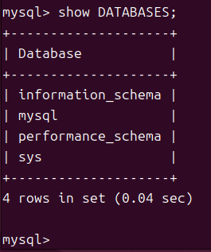
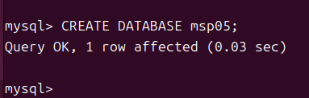
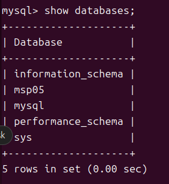
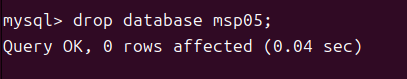
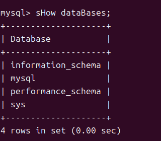

# DATABASE
## Database 생성 
> 데이터베이스를 새로 만들 때 사용
### 형식

###  데이터베이스 목록 확인
``` sql
SHOW Databases;
```

### 데이터베이스 생성

``` sql
CREATE DATABASE MSP05;
```

### 생성된 데이터베이스 목록 확인
``` sql
SHOW Databases;
```


## 데이터베이스 삭제 
> 

### 기본 형식 
``` sql
DROP DATABASE [IF EXISTS] <databasename>;
```

### 데이터베이스 목록 확인
``` sql
SHOW DATABASES;
```


### 데이터베이스 삭제
``` sql
DROP DATABASE msp05;
```



### 삭제된 데이터베이스 목록 확인 
``` sql
SHOW Databases;
```

