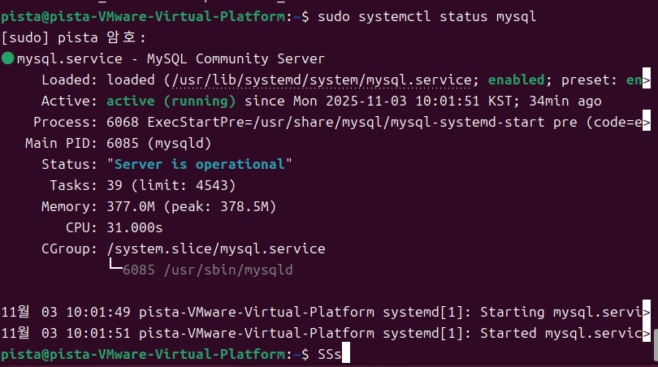
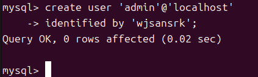
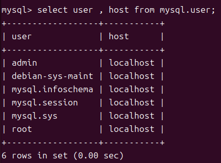
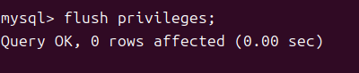

[참고](https://www.notion.so/MySQL-29287ff2741980918545ff62e2364044?source=copy_link)
## MySQL 서비스 
### 📦 서비스 상태 확인
``` sql
sudo systemctl status mysql
```

### 📦 sudo 접속
``` sql
sudo  mysql -u root -p 
```

### 📦 사용자 확인
``` sql
select user, host from mysql.user;
```
### 📦 사용자 추가
``` sql
CREATE USER 'admin'@'localhost' identified by '<YOUR_PASSWORD>';
```



### 📦 사용자 확인
``` sql
SELECT USER, host FROM mysql.user;
```


### 📦 즉시 적용
``` sql
flush privileges;
```


## MySQL Workbench 접속
``` sql

```
### 📦 
```sql

```
##

