# TABLE

## 기본 형식

## 사용 예

### 📦데이터베이스 사용

```sql
USE MSP05;
```

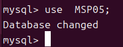
### 📦테이블 생성Duplicate
``` sql
CREATE TABLE IF NOT EXISTS TMEMBER (
    FID     VARCHAR(20)  NOT NULL COMMENT '회원ID',
    FNAME   VARCHAR(30)  NOT NULL COMMENT '회원명',
    FBRITH  YEAR         NOT NULL COMMENT '생년',
    FSEX    CHAR(1)      NOT NULL COMMENT '성별',
    FADDR   VARCHAR(100) NOT NULL COMMENT '주소',
    PRIMARY KEY (FID)
) COMMENT='회원 테이블';
```

``` sql
CREATE TABLE  📦member (
    FID     VARCHAR(20)   NULL COMMENT '회원ID',
    FNAME   VARCHAR(30)  NOT NULL COMMENT '회원명',
) COMMENT='회원 테이블';
```

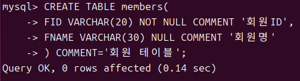


### ⛔테이블 생성 오류 : 데이터베이스 사용 안함

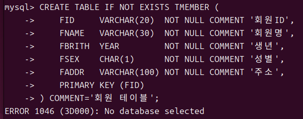

### ✅데이터베이스 사용

```sql
USE MSP05;
```

### 생성된 테이블 확인 (중요)

``` sql
SHOW TABLES;
DESC TMEMBER;
```

### 📦TMEMBER 테이블

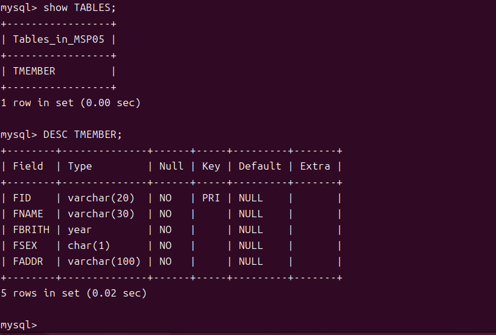

### 📦members 테이블

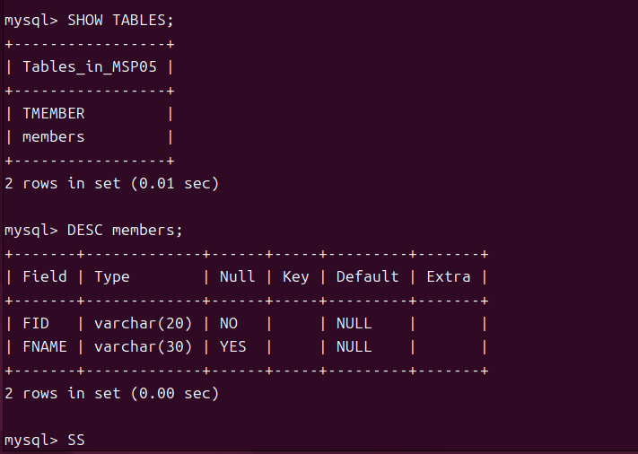

### 📦members 열 삽입 

``` sql
insert_into_members_(fid)_value_('yong');
```

_value_('yong').png)

### 📦members 테이블 조회

``` sql
select * from members;
```
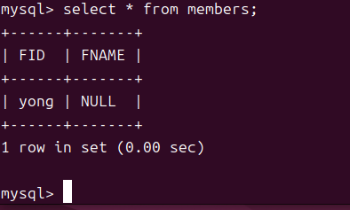

### ⛔ 잘못된 NOT NULL 열 삽입 
``` sql
insert into members (fname) value ('PISTA');
```

> FID는 NULL 되면 안됨, 또한 기본값을 가지고 있지않아 에러 발생

### ✅ NOT NULL 포함한 열 삽입
``` sql
insert into members_(COL1,COL2) value(VAL1,VAL2)
```
``` sql 
insert into_members_(fid,fname) value('pista','yonghyeon');

select * from members;
```
_value('pista','yonghyeon').png)

### 📦pista 테이블 열 삭제
```sql
DELETE FROM members where fid='pista';

select * from memebers;
```
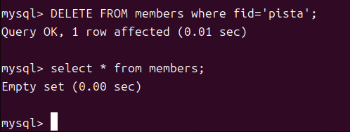

### char 범위 오류 with Mysql Wrokbench
* char또는 varchar의 범위를넘어가서는 안된다.
``` sql
--- 데이터베이스 사용 
use MSP05;

--- TEST 테이블 추가
CREATE TABLE TEST (
	fnum	tinyint default 0,
    fjumin1 char(6) not null,
    fname 	varchar(4)
);
```
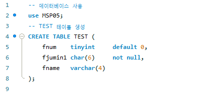

### ⛔ CHAR 범위를 넘은 값을 사용한 에러발생

```sql
insert into TEST (fjumin1, fname) value ('123', 'Hello, MySQL');
-- Error Code: 1406. Data too long for column 'fname' at row 1
```


### ✅ CHAR 범위내에 값음 사용

```sql
insert into TEST (fjumin1, fname) value ('123', 'Hell');
-- 1 row(s) affected

select * from TEST;
```

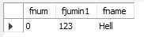

### 날짜 추가  with Mysql Wrokbench 

---
# 2025-11-04

### 테이블 생성
```sql
use MSP05;

CREATE TABLE IF NOT EXISTS test1 (
	fidx        int 		not	null,
    femail		varchar(50)	not null,
    fbirth		date		not	null,
    fname		varchar(20)	not	null,
    fphone		varchar(13) ,
    faddr1		varchar(40) not	null,
    faddr2		varchar(40),
    fregdate	datetime	not null
);
-- 결과 확인 
describe MSP05.test1;
```

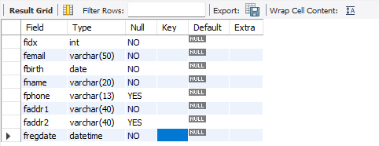

## 테이블

### 테이블 이름 변경 `RENAME`

```sql
`RENAME TABLE` <table_name> TO <new_table_name>;
```

``` sql
RENAME TABLE test1 to test;
describe MSP05;
```


### 테이블 옮기기 `RENAME`

> 테이블을 다른 데이터베이스로 이동 및  테이블 가져오기

```sql
RENAME TABLE <table_name> TO <new_table_name>
```

```sql
-- 테이블 생성
CREATE DATABASE testdb;
-- 테이블 옮김
RENAME TABLE test TO testdb.test;
RENAME TABLE testdb.test TO test;
```

## 컬럼

### 추가

> 테이블의 컬럼을 새로 추가

```sql
ALTER TABLE <table_name> ADD <new_column> <data_type> ... ;
```

```sql
ALTER TABLE test
ADD faddr3 varchar(20);
```

### 컬럼 삭제 `DROP`

> 테이블의 컬럼을 삭제

```sql
ALTER TABLE <table_name> DROP <column_name>;
```

```sql
ALTER TABLE test DROP fadder3;
-- 확인
describe MSP05.test;
```

### 행 추가 (컬럼제외)

> insert시 컬럼을 제외하고 행을 추가 가능하다. 

> 이전

```sql
INSERT into  test 

values( 1,'pyh5523@gmail.com','1999-05-21','박용현','010-2686-5523','경기도 광명시',now());
```

> 이후

```sql
INSERT into  test 
values( 1,'pyh5523@gmail.com','1999-05-21','박용현','010-2686-5523','경기도 광명시',now());
```

### 컬럼 변경 `ㄹ`
> 

### 컬럼 수정 `ㄹ`
> 


### 📦행 삭제 `DELETE FROM`

> 테이블 안의 모든 행 삭제

* DELETE FROM 이 안될경우 :

1. `EDIT` > `Preferences` > `SQL Editor` > `Safe Updated (uncheck)`
2. `MySQL Workbench` 실행 

```sql
DELETE FROM <table_name> [where 조건];
```

```sql
DELETE FROM test;
```

### 📦행 삭제 (TRUNCATE)

```sql
TRUNCATE <table_name>;
```

```sql
TRUNCATE test;
select * from test;
```

## 기본키 

## 고유키

## 참조키

* 선행 : `FOREIGN KEY`대상 열에 `PRIMARY KEY`키 발급 할것 

### 추가
```sql
ALTER TALBE <table_name> ADD CONSTRAINT <foreign_key_name>
FOREIGN KEY(<column_name>) REFERENCES <target_table_name> (<cloumn_name>);
```
> 테이블 생성
```sql
CREATE TABLE IF NOT EXISTS test2 (
	fidx	 int,
    ftestidx int		not	null,
    fmemo	 varchar(100)	not	null,
    fdate	 datetime	not null
);
```

```sql
describe test2;
```
> `FOREIGN KEY` 발급에 대상 지정 (중요)
```sql
ALTER TABlE test2 
ADD constraint fk_ftestidx_test2
FOREIGN KEY (ftestidx)
REFERENCES test (fidx);

```

> SHELL에서 확인 

```shell
mysql> show create table test2
```

### 📦삭제 

* `foreign_key_checks`참조키 제약  무결성 설정 및 해제

```sql
SET foreign_key_checks=0; 
ALTER TABLE <table_name> DROP FOREIGN KEY <foreign_key_name
SET foreign_key_checks=1; 

```

``` sql
ALTER TABLE test2 DROP FOREIGN KEY fk_ftestidx_test2;
```

> [결과] MySQL Workbench에서 확인 

```sql
11:58:45	ALTER TABLE test2 DROP FOREIGN KEY fk_ftestidx_test2	0 row(s) affected Records: 0  Duplicates: 0  Warnings: 0	0.000 sec
```

> [check] fk_testidx_test2에 없는지 

``` shell
| test2 | CREATE TABLE `test2` (
  `fidx` int DEFAULT NULL,
  `ftestidx` int NOT NULL,
  `fmemo` varchar(100) NOT NULL,
  `fdate` datetime NOT NULL,
  KEY `fk_ftestidx_test2` (`ftestidx`)
) ENGINE=InnoDB DEFAULT CHARSET=utf8mb4 COLLATE=utf8mb4_0900_ai_ci |
```

### 📦수정

선행 

```sql
ALTER TABLE <table_name> DROP FOREIGN KEY <foreign_key_name>;
```

``` sql
ALTER TABLE test2 DROP FOREIGN KEY fk_ftestidx_test2;
```

## 인덱스 

### 📦조회

```sql
SHOW INDEX FORM <table_name>;
```

```sql
SHOW INDEX FROM test;
```

> 결과 

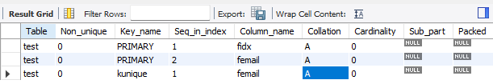

### 생성 (중복 허용)

```sql
CREATE INDEX <index_name> ON <table_name> (<column_name>); 
```

```sql
CREATE INDEX idx_test ON test ( femail );
SHOW INDEX FROM test;
```

> 결과 

.png)

> check

```sql
INSERT INTO test values
('1','pistachio@gmail.com','1111-11-11','YonghyeonPark','010-1111-1111','경기도:광명시','sysdate()'),
('2','pistachio@gmail.com','2222-22-22','pistachio','010-2222-2222','서울시:강남구','sysdate()');
```

### 생성 (중복 불허)

```sql
CREATE UNIQUE INDEX <index_name> ON <table_name> (<column_name>); 
```

```sql
CREATE UNIQUE INDEX idex_test ON test (femail);
SHOW INDEX FROM test;
```

> check

```sql
INSERT INTO test values
('1','pistachio@gmail.com','1111-11-11','YonghyeonPark','010-1111-1111','경기도:광명시','sysdate()'),
('2','pistachio@gmail.com','2222-22-22','pistachio','010-2222-2222','서울시:강남구','sysdate()');
```

> 결과

```sql
Error Code: 1292. Incorrect datetime value: 'sysdate()' for column 'fregdate' at row 1
```

### 생성 ALTER 

> ALTER문을 활용한 INDEX 생성

```sql
ALTER TABLE <table_name> ADD INDEX <index_name> (<column_name>);

ALTER TABLE <table_name> ADD UNIQUE INDEX <index_name> (<column_name>);

ALTER TABLE <table_name> ADD FULLTEXT INDEX <index_name> (<column_name>);

ALTER TABLE <table_name> ADD PRIMARY KEY INDEX <index_name> (<column_name>);
```

```sql
ALTER TABLE test ADD INDEX idx_test (femail);
SHOW INDEX FROM test;
```

### 📦삭제
>형식
```sql
DROP INDEX <index_name> ON <talbe_name>;
```

```sql
DROP INDEX idx_test ON test;
SHOW INDEX FROM test;
```

## 사용자 

### 사용자 추가 

```sql
CREATE USER `<user_name>'@'<host_info>'  IDENTIFIED [WITH 암호화방식]BY '<password>';
FLUSH PRIVILEGES; -- 사용자 즉시 적용

```

### 사용자 삭제 

```sql
DROP USER '<user_name>'@'<host_info>';
```

## 사용자 권한 

### 권한 확인

```sql
SHOW GRANTS FOR '<user_name>'@'<localhost>';
```

```sql
SHOW GRANTS FOR 'pista1'@'localhost';
```

### 권한 부여

```sql
GRANT ALL PRIVILEGES ON [database_name].* TO '<user_name>'@'<localhost>';
```

```sql
GRANT ALL PRIVILEGES ON PISTA1.* TO 'pista1'@'localhost';
SHOW GRANTS FOR 'pista1'@'localhost';
```

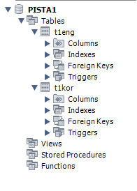
>

```sql
GRANT ALL privileges ON PISTA2.t2kor TO 'pista2'@'localhost';
SHOW GRANTS FOR 'pista2'@'localhost';
```

> 결과  
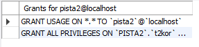
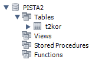

```sql
GRANT SELECT,UPDATE,INSERT,DELETE ON PISTA2.* TO 'pista3'@'localhost';
FLUSH privileges;
SHOW GRANTS FOR 'pista2'@'localhost';
```

