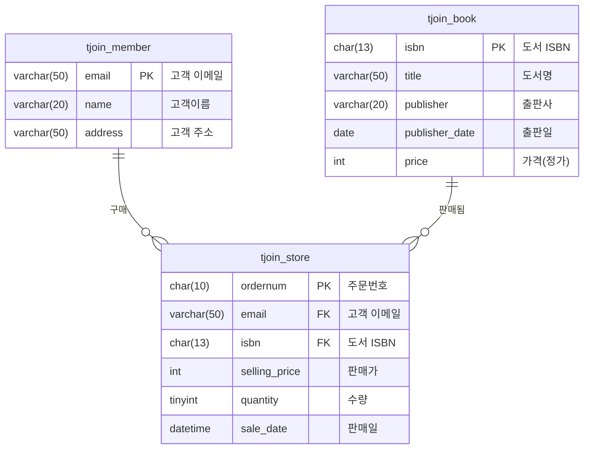

# JOIN


```sql

USE PISTA1;

CREATE TABLE IF NOT EXISTS tjoin_store (
	ordernum		char(10),
    email			varchar(50)				COMMENT '고객 이메일',
	isbn			char(13)	NOT NULL	COMMENT '도서 ISBN을 기본키로 사용',
	selling_price	int						COMMENT '판매가',
    quantity		tinyint					COMMENT '수량',
    sale_date		datetime				COMMENT '판매일',
    CONSTRAINT pk_store	PRIMARY KEY (ordernum)
) COMMENT '서점 도서 판매정보 테이블';

INSERT INTO tjoin_store values
('2511010001', 'a@b.co.kr', '1111111111111', '18000', '1', '2025-09-24'),
('2511020001', 'b@cc.co.kr', '2222222222222', '17100', '1', '2025-10-12'),
('2511030001', 'c@dd.kr', '3333333333333', '31500', '2', '2025-10-12'),
('2511040001', 'a@b.co.kr', '4444444444444', '17100', '1', '2025-09-24'),
('2511040002', 'c@dd.kr', '1111111111111', '18900', '1', '2025-09-24'),
('2511040003', 'iu@dra.co.kr', '2222222222222', '18000', '14', '2025-09-24'),

;

DROP TABLE IF EXISTS tjoin_member;
CREATE TABLE IF NOT EXISTS tjoin_member (
    email		varchar(50)		COMMENT '고객 이메일',
    name		varchar(20)		COMMENT '고객이름',
    address		varchar(50)		COMMENT '고객 주소',
    CONSTRAINT pk_member PRIMARY KEY (email)
) COMMENT '회원 정보 테이블';

INSERT INTO tjoin_member values
('a@b.co.kr', '홍길동', '서울'),
('b@cc.co.kr', '김유신', '서울'),
('c@dd.kr', '이순신', '경기'),
('iu@dra.co.kr', '아이유', '제주'),
('shj@ian.co.kr', '신혜지', '충남')
;

DROP TABLE IF EXISTS tjoin_book;
CREATE TABLE IF NOT EXISTS tjoin_book (
	isbn			char(13)	NOT NULL	COMMENT '도서 ISBN을 기본키로 사용',
    title			varchar(50)				COMMENT '도서명',
    publisher			varchar(20)			COMMENT '출판사',
    publisher_date		date				COMMENT '출판일',
    price				int					COMMENT '가격(정가)',
    CONSTRAINT pk_book	PRIMARY KEY (isbn)
) COMMENT '도서 정보 테이블';

INSERT INTO tjoin_book values
('1111111111111', '이것이 MariaDB다', '한빛미디어', '2020-05-23', '20000'),
('2222222222222', 'AWS로 구현하는 CI/CD', '앤써북', '2022-10-07', '19000'),
('3333333333333', '파이썬', '길벗', '2021-12-22', '35000'),
('4444444444444', '깃&깃허브 입문', '영진닷컴', '2023-07-23', '21000'),
('5555555555555', '혼자서 공부하는 우분투 리눅스', '한빛아카데미', '2025-01-31', '34000')
;


```



### 📦INNERT JOIN 
> 모든 테이블에 공통으로 있는 데이터 필드의 값을 포함한 레코드 반환
``` sql 
select * FROM tjoin_store a
INNER JOIN tjoin_member b ON a.email = b.email
INNER JOIN tjoin_book c ON a.isbn = c.isbn;
```

### LEFT JOIN 

> 순서대로 우선 기준 테이블이 정해짐

```sql
select * FROM tjoin_store a 
LEFT JOIN tjoin_member  b ON a.email = b.email;
```

-- WHERE

```sql
select * FROM tjoin_store a
LEFT JOIN tjoin_
```


### 학생 테이블

|학생명|학과|지도교수명|지도교수연락처|학과사무실 연락처|학생이메일 
|---|---|---|---|---|---|
