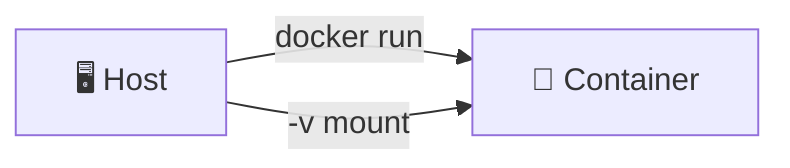
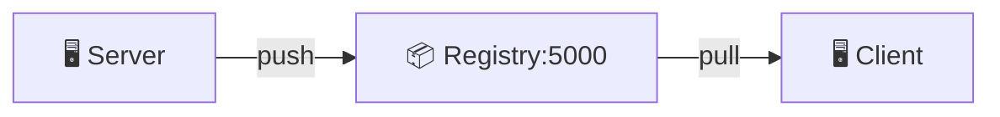
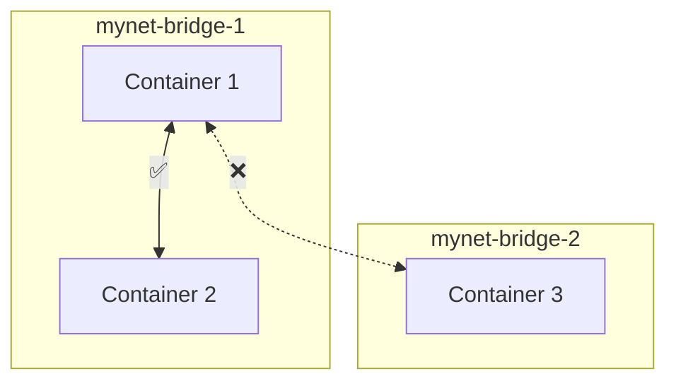
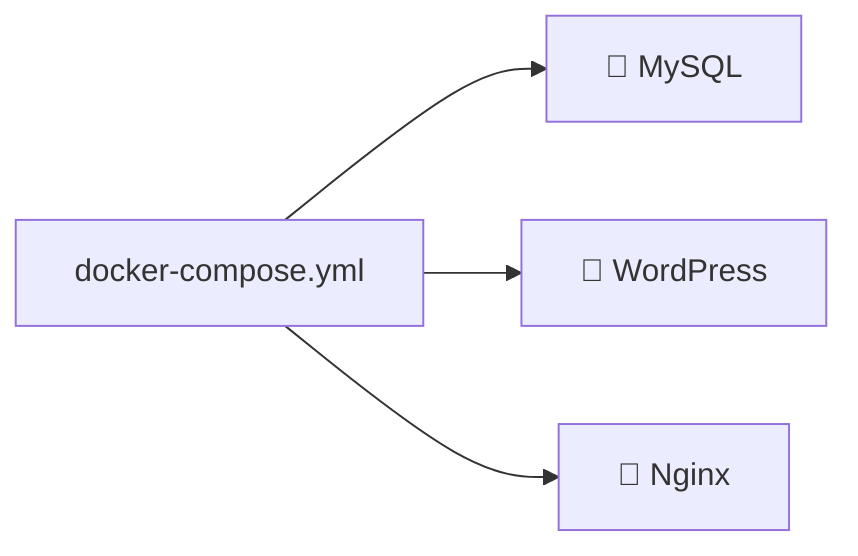

# Docker 학습 가이드

## 📚 목차

- [Day 1 - Docker 기초](#day-1---docker-기초)
- [Day 2 - 이미지 & MySQL](#day-2---이미지--mysql)
- [Day 4 - Private Registry](#day-4---private-registry)
- [Day 5 - 네트워크](#day-5---네트워크)
- [Day 6 - Docker Compose](#day-6---docker-compose)

---

## Day 1 - Docker 기초

> Ubuntu 컨테이너, Nginx 웹서버, Volume Mount

📖 [상세 문서](./day1-1126/README.md)

---

## Day 2 - 이미지 & MySQL

> Nginx 이미지, Docker Commit, MySQL 구축

📖 [상세 문서](./day2-1127/README.md)

---

## Day 4 - Private Registry

> 프라이빗 레지스트리 구축, 이미지 Push/Pull

📖 [상세 문서](./day4-1201/README.md)

---

## Day 5 - 네트워크

> 브리지 네트워크, 네트워크 격리, WordPress+MySQL

📖 [상세 문서](./day5-1202/README.md)

---

## Day 6 - Docker Compose

> 다중 컨테이너 관리, WordPress+MySQL+Nginx

📖 [상세 문서](./day6-1203/README.md)
