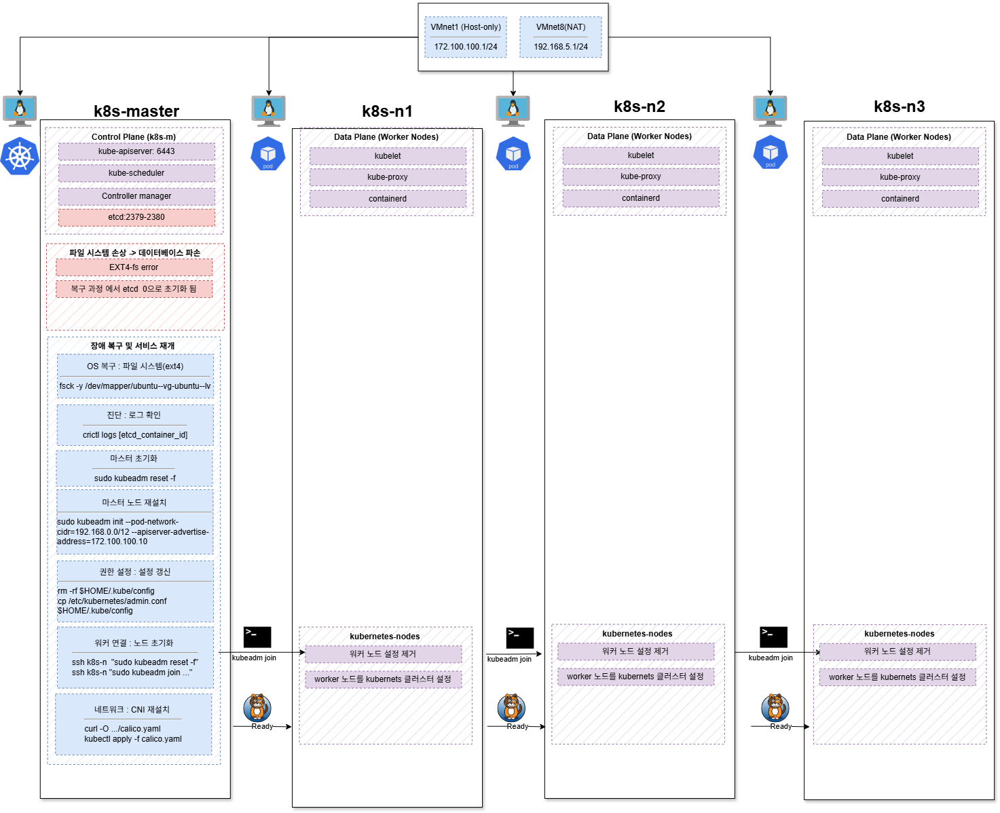

# Day 4 - etcd 장애 복구 가이드

## 📚 목차

- [1. 증상](#1-증상)
- [2. 진단](#2-진단)
- [3. 복구 절차](#3-복구-절차)
- [4. 테스트](#4-테스트)

---

## 1. 증상



**원인**: 파일 시스템 손상으로 etcd 데이터베이스 파손

---

## 2. 진단

```bash
# 파일시스템 복구 (initramfs에서)
fsck -y /dev/mapper/ubuntu--vg-ubuntu--lv

# etcd 컨테이너 상태 확인
sudo crictl ps -a | grep etcd

# 로그 확인
sudo crictl logs [컨테이너ID]
# → "panic: assertion failed" 확인
```

---

## 3. 복구 절차

### 마스터 초기화

```bash
sudo kubeadm reset -f
sudo rm -rf /etc/cni/net.d  # 네트워크 충돌 방지

sudo kubeadm init \
  --pod-network-cidr=192.168.0.0/12 \
  --apiserver-advertise-address=172.100.100.10
```

### kubectl 설정

```bash
mkdir -p $HOME/.kube
rm -rf $HOME/.kube/config
sudo cp -i /etc/kubernetes/admin.conf $HOME/.kube/config
sudo chown $(id -u):$(id -g) $HOME/.kube/config
```

### 워커 노드 재연결

```bash
# 토큰 생성
kubeadm token create --print-join-command

# 워커 초기화 및 재연결
for node in k8s-n1 k8s-n2 k8s-n3; do
  ssh $node "sudo kubeadm reset -f"
  ssh $node "sudo kubeadm join 172.100.100.10:6443 --token [TOKEN] --discovery-token-ca-cert-hash [HASH]"
done
```

### CNI 설치

```bash
curl -O https://raw.githubusercontent.com/projectcalico/calico/v3.25.0/manifests/calico.yaml
kubectl apply -f calico.yaml

kubectl get nodes  # Ready 상태 확인
```

---

## 4. 테스트

```bash
# nginx 테스트 배포
kubectl apply -f nginx-test.yaml
kubectl get pods -l app=nginx-test

# 정리
kubectl delete -f nginx-test.yaml
```
