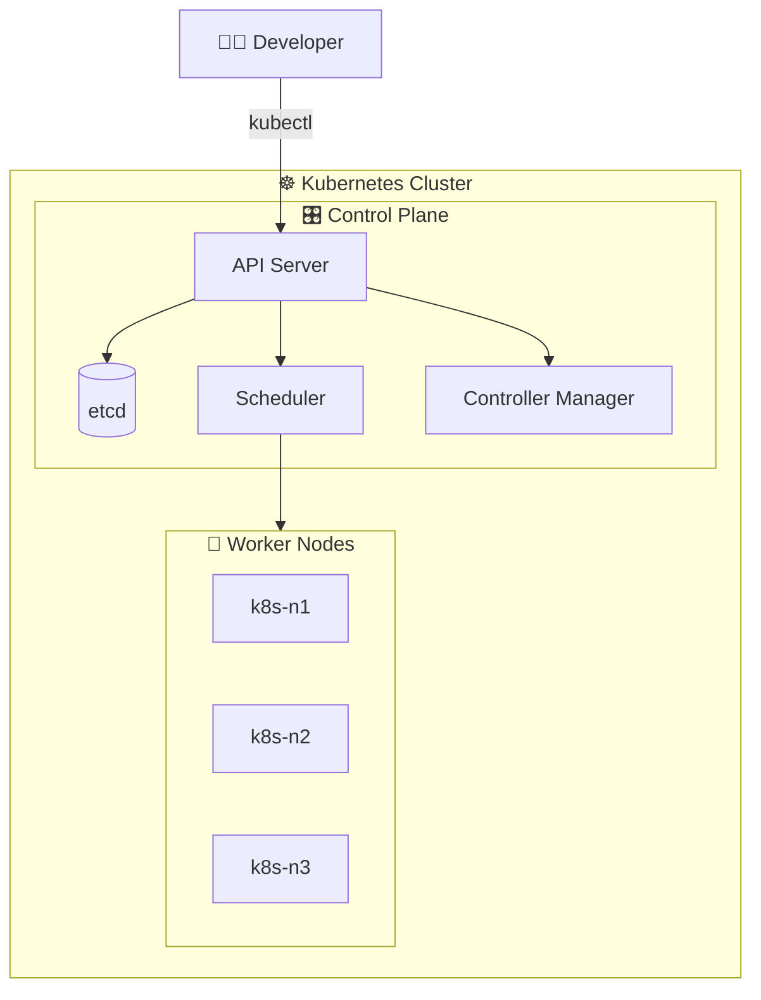
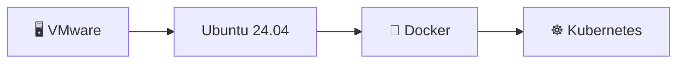
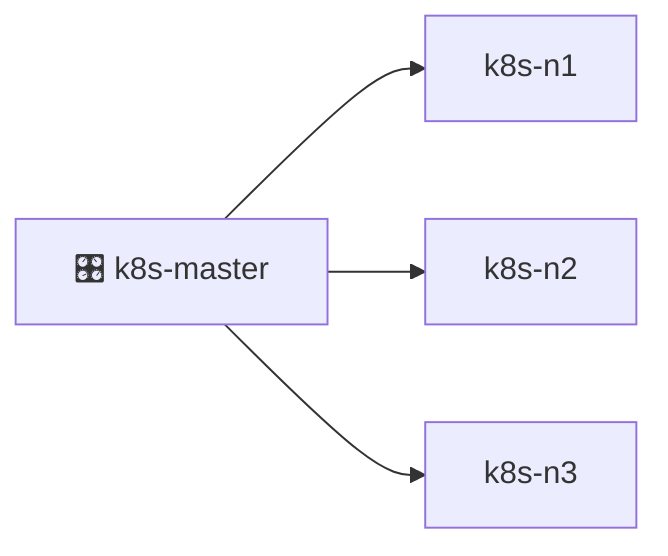
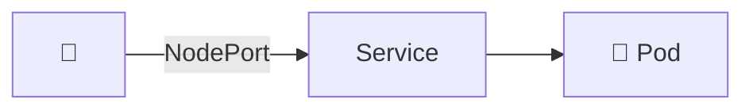
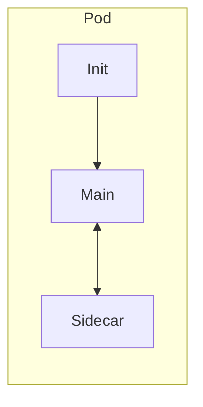
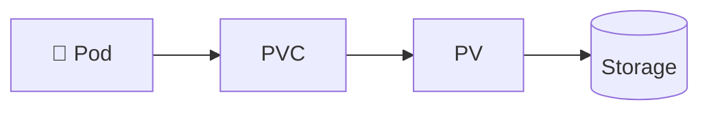
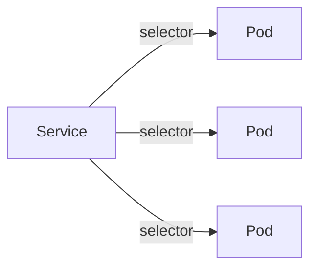
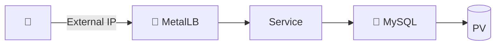

# Kubernetes 학습 가이드

## 📚 목차

- [전체 아키텍처](#전체-아키텍처)
- [Day 1 - 환경 구축](#day-1---환경-구축)
- [Day 2 - 클러스터 구성](#day-2---클러스터-구성)
- [Day 3 - Pod & Service](#day-3---pod--service)
- [Day 4 - Container 패턴](#day-4---container-패턴)
- [Day 5 - Volume](#day-5---volume)
- [Day 6 - Labels & Deployment](#day-6---labels--deployment)
- [Day 7 - MetalLB & MySQL](#day-7---metallb--mysql)

---

## 전체 아키텍처

---

## Day 1 - 환경 구축

> Docker, Kubernetes 설치 및 초기 설정

📖 [상세 문서](./day1-1204/README.md)

---

## Day 2 - 클러스터 구성

> Master-Worker 클러스터 구성 및 Calico CNI

| 노드 | IP | 역할 |
|------|-----|------|
| k8s-master | 172.100.100.10 | Control Plane |
| k8s-n1~n3 | 172.100.100.11~13 | Worker |

📖 [상세 문서](./day2-1205/README.md)

---

## Day 3 - Pod & Service

> Pod 생성, Service 노출, Dashboard

📖 [상세 문서](./day3-1208/README.md)

---

## Day 4 - Container 패턴

> Deployment, InitContainer, Sidecar

📖 [상세 문서](./day4-1209/README.md) | [트러블슈팅](./day4-1209/ISSUE.md)

---

## Day 5 - Volume

> emptyDir, hostPath, PV, PVC

📖 [상세 문서](./day5-1210/README.md)

---

## Day 6 - Labels & Deployment

> Label Selector, Service 매칭

📖 [상세 문서](./day6-1211/README.md)

---

## Day 7 - MetalLB & MySQL

> LoadBalancer, MySQL 전체 구성

📖 [상세 문서](./day7-1212/README.md)
