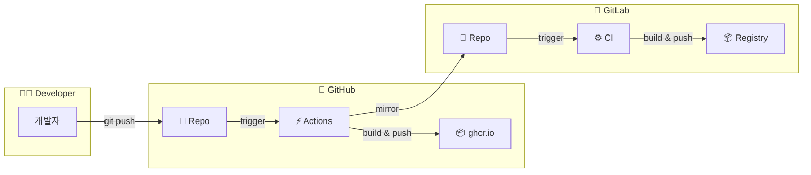
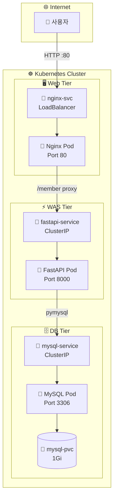
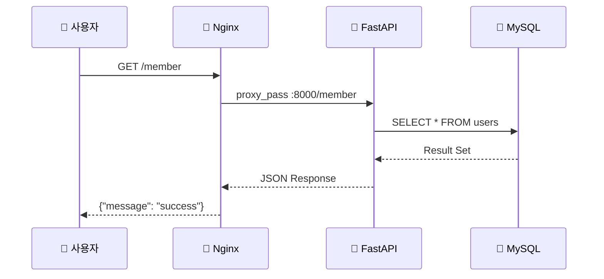
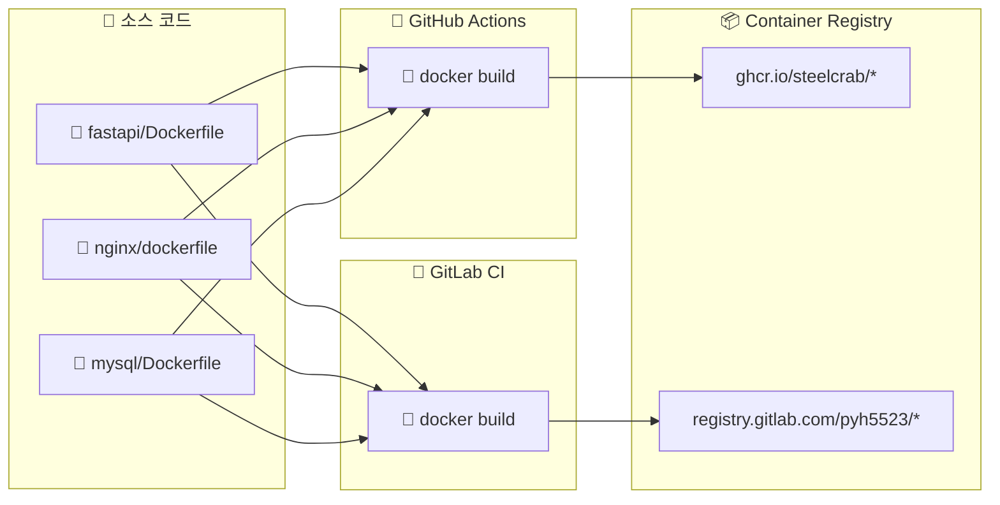
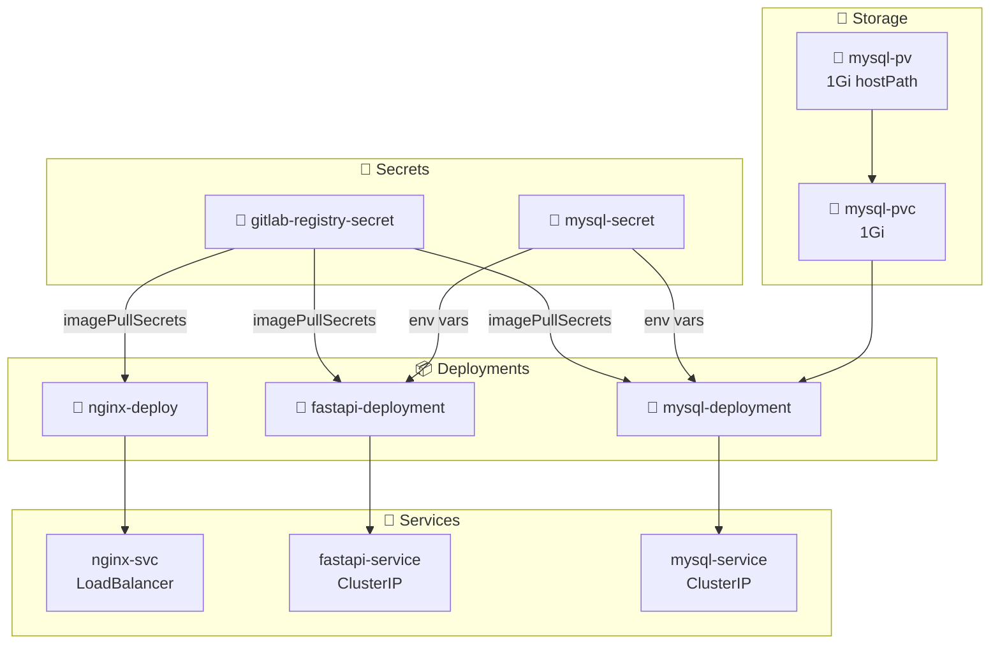

# 📊 프로젝트 아키텍처 다이어그램

## 1. 🚀 CI/CD 파이프라인

## 2. ☸️ Kubernetes 3-Tier 아키텍처

## 3. 🔄 데이터 흐름

## 4. 🐳 Docker 이미지 빌드 흐름

## 5. 🔐 Kubernetes 리소스 관계

## 📋 아이콘 범례

| 아이콘 | 의미 |
|--------|------|
| 🐙 | GitHub |
| 🦊 | GitLab |
| 🐍 | Python/FastAPI |
| 🔷 | Nginx |
| 🐬 | MySQL |
| ☸️ | Kubernetes |
| 🐳 | Docker |
| 📦 | Container/Package |
| 🔐 | Secret |
| 💾 | Storage |
