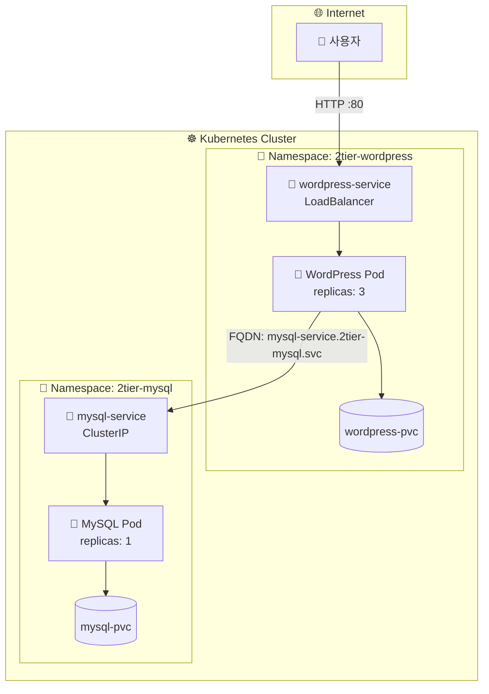
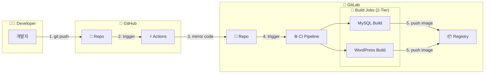

# 📦 2-Tier Architecture: WordPress + MySQL

Kubernetes 환경에서의 WordPress (Frontend/Backend 통합) 및 MySQL (Database) 2-Tier 구성 아키텍처임.

## 📚 목차

- [📊 아키텍처 다이어그램](#-아키텍처-다이어그램)
- [🦊 GitLab CI/CD 파이프라인](#-gitlab-cicd-파이프라인)
- [🏗️ 구성 요소](#️-구성-요소)
- [💾 Volume 구성](#-volume-구성)
- [🚀 배포 방법](#-배포-방법)
- [🧹 리소스 정리](#-리소스-정리)

---

## 📊 아키텍처 다이어그램



---

## 🦊 GitLab CI/CD 파이프라인

이 프로젝트는 **GitHub Push -> GitLab Mirroring -> GitLab CI Build** 과정을 통해 2-Tier용 이미지를 자동으로 빌드하고 배포함.



| Job Name | Stage | 역할 | Dockerfile 위치 | 대상 이미지 |
|---|---|---|---|---|
| `build-2tier-mysql` | build | MySQL 8.0 커스텀 이미지 빌드 | `2-tier/mysql/Dockerfile` | `registry.gitlab.com/.../2tier-mysql` |
| `build-2tier-wordpress` | build | WordPress 커스텀 이미지 빌드 | `2-tier/wordpress/Dockerfile` | `registry.gitlab.com/.../2tier-wordpress` |

**실행 조건:**
- 브랜치: `feat/on-premise-ict`
- 트리거: 해당 브랜치에 Push 발생 시 자동 실행

---

## 🏗️ 구성 요소

| 컴포넌트 | Namespace | Role | Replicas | Service Type |
|---------|-----------|------|----------|--------------|
| WordPress | `2tier-wordpress` | 웹 서버 및 CMS | 3 | LoadBalancer |
| MySQL | `2tier-mysql` | 데이터베이스 | 1 | ClusterIP |

### 1. WordPress (App Tier)
- **Namespace:** `2tier-wordpress`
- **Role:** 웹 서버 및 CMS 애플리케이션
- **Replicas:** 3
- **Service Type:** `LoadBalancer` (외부 접속 허용)
- **Volume:** `/var/www/html` (테마, 플러그인, 업로드 파일)

### 2. MySQL (Data Tier)
- **Namespace:** `2tier-mysql`
- **Role:** 데이터베이스
- **Replicas:** 1
- **Service Type:** `ClusterIP` (내부 통신 전용)
- **Volume:** `/var/lib/mysql` (DB 데이터 영구 저장)

---

## 💾 Volume 구성

| 컴포넌트 | Mount Path | 설명 |
|---|---|---|
| **WordPress** | `/var/www/html` | 테마, 플러그인, 업로드 파일 영구 저장 |
| **MySQL** | `/var/lib/mysql` | DB 데이터 파일 영구 저장 |

---

## 🚀 배포 방법

### 1️⃣ 사전 준비 (.env 설정)
상위 디렉토리(`day3-1217`)의 `.env` 파일을 사용함.

```bash
# .env 파일 생성 (없을 경우)
cp .env.example .env

# .env 파일 수정 
# MYSQL_ROOT_PASSWORD, MYSQL_USER, MYSQL_PASSWORD, MYSQL_DATABASE
# WORDPRESS_DB_NAME (자동 생성될 DB명)
# DOCKER_CONFIG_JSON_BASE64 (이미지 Pull용 시크릿)
vi .env
```

### 2️⃣ MySQL 배포 (2tier-mysql)
데이터베이스를 먼저 배포함.

```bash
# 2-tier 폴더에서 실행
cd 2-tier

# .env 로드 및 배포
set -a && source ../.env && set +a && envsubst < mysql/mysql.yaml | kubectl apply -f -

# 확인
kubectl get all -n 2tier-mysql
```

### 3️⃣ WordPress 배포 (2tier-wordpress)
MySQL이 준비되면 WordPress를 배포함.

```bash
# .env 로드 및 배포
set -a && source ../.env && set +a && envsubst < wordpress/wordpress.yaml | kubectl apply -f -

# 확인
kubectl get all -n 2tier-wordpress
```

### 4️⃣ 접속 확인
LoadBalancer IP를 확인하여 접속함.

```bash
kubectl get svc -n 2tier-wordpress
# EXTERNAL-IP 확인 후 브라우저 접속 (http://<EXTERNAL-IP>)
```

---

## 🧹 리소스 정리

배포된 리소스를 완전히 정리하려면 아래 순서대로 진행함.

### 1️⃣ Namespace 삭제
네임스페이스를 삭제하면 내부 리소스도 함께 삭제됨.

```bash
# 전체 네임스페이스 삭제
kubectl delete ns 2tier-wordpress 2tier-mysql

# 삭제 확인
kubectl get ns | grep 2tier
```

### 2️⃣ PersistentVolume 삭제
PV는 클러스터 레벨 리소스이므로 별도로 삭제해야 함.

```bash
# PV 삭제
kubectl delete pv 2tier-mysql-pv 2tier-wordpress-pv

# 삭제 확인
kubectl get pv | grep 2tier
```

### 3️⃣ 호스트 데이터 정리 (선택)
hostPath 볼륨 데이터를 완전히 삭제하려면:

```bash
# 각 노드에서 실행
sudo rm -rf /data/2tier/mysql
sudo rm -rf /data/2tier/wordpress
```

### ⚡ 한번에 정리 (빠른 정리)

```bash
# 네임스페이스 삭제 (내부 리소스 자동 삭제)
kubectl delete ns 2tier-wordpress 2tier-mysql

# PV 삭제
kubectl delete pv 2tier-mysql-pv 2tier-wordpress-pv
```
