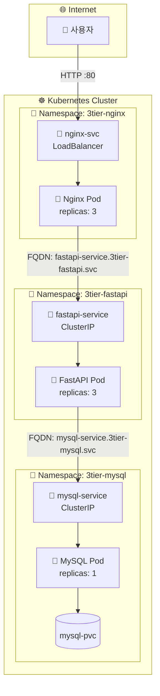
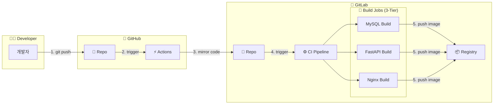

# 📦 3-Tier Architecture: Nginx + FastAPI + MySQL

Kubernetes 환경에서의 **Web(Nginx) - WAS(FastAPI) - DB(MySQL)** 3-Tier 구성 아키텍처임.

## 📚 목차

- [📊 아키텍처 다이어그램](#-아키텍처-다이어그램)
- [🦊 GitLab CI/CD 파이프라인](#-gitlab-cicd-파이프라인)
- [🏗️ 구성 요소](#️-구성-요소)
- [📦 크로스 네임스페이스 통신](#-크로스-네임스페이스-통신)
- [💾 Volume 구성](#-volume-구성)
- [🚀 배포 방법](#-배포-방법)
- [🧹 리소스 정리](#-리소스-정리)

---

## �📊 아키텍처 다이어그램



## 🦊 GitLab CI/CD 파이프라인

이 프로젝트는 **GitHub Push -> GitLab Mirroring -> GitLab CI Build** 과정을 통해 3-Tier용 이미지를 자동으로 빌드하고 배포함.



| Job Name | Stage | 역할 | Dockerfile 위치 | 대상 이미지 |
|---|---|---|---|---|
| `build-3tier-mysql` | build | MySQL 8.0 커스텀 이미지 빌드 | `3-tier/mysql/Dockerfile` | `registry.gitlab.com/.../3tier-mysql` |
| `build-3tier-fastapi` | build | FastAPI 애플리케이션 이미지 빌드 | `3-tier/fastapi/Dockerfile` | `registry.gitlab.com/.../fastapi` |
| `build-3tier-nginx` | build | Nginx 커스텀 이미지 빌드 | `3-tier/nginx/Dockerfile` | `registry.gitlab.com/.../3tier-nginx` |

**실행 조건:**
- 브랜치: `feat/on-premise-ict`
- 트리거: 해당 브랜치에 Push 발생 시 자동 실행

## 🏗️ 구성 요소

### 1. Nginx (Web Tier)
- **Namespace:** `3tier-nginx`
- **Role:** 정적 파일 서빙 및 리버스 프록시
- **Replicas:** 3
- **Service Type:** `LoadBalancer` (외부 접속 허용)
- **Volume:** `/usr/share/nginx/html` (정적 파일)

### 2. FastAPI (WAS Tier)
- **Namespace:** `3tier-fastapi`
- **Role:** API 비즈니스 로직 처리
- **Replicas:** 3
- **Service Type:** `ClusterIP` (내부 통신 전용)
- **Volume:** `/app` (애플리케이션 코드)

### 3. MySQL (DB Tier)
- **Namespace:** `3tier-mysql`
- **Role:** 데이터 관리 및 저장
- **Replicas:** 1
- **Service Type:** `ClusterIP` (내부 통신 전용)
- **Volume:** `/var/lib/mysql` (DB 데이터 영구 저장)

## 📦 크로스 네임스페이스 통신

각 티어가 분리된 네임스페이스에 배포되므로, **FQDN**을 사용하여 통신함.

| 통신 방향 | FQDN |
|----------|------|
| Nginx → FastAPI | `fastapi-service.3tier-fastapi.svc.cluster.local` |
| FastAPI → MySQL | `mysql-service.3tier-mysql.svc.cluster.local` |

## �💾 Volume 구성

| 컴포넌트 | Mount Path | 설명 |
|---|---|---|
| **Nginx** | `/usr/share/nginx/html` | 정적 웹 콘텐츠 (HTML, CSS 등) 저장 |
| **FastAPI** | `/app` | Python 애플리케이션 소스 코드 저장 |
| **MySQL** | `/var/lib/mysql` | 데이터베이스 파일 영구 저장 |


## 🚀 배포 방법

### 1️⃣ 사전 준비 (.env 설정)
최상위 디렉토리(`3-tier`)의 `.env` 파일을 사용함.

```bash
# .env 파일 생성 (없을 경우)
cp .env.example .env

# .env 파일 수정 
# MYSQL_ROOT_PASSWORD, MYSQL_USER, MYSQL_PASSWORD, MYSQL_DATABASE
# DOCKER_CONFIG_JSON_BASE64 (이미지 Pull용 시크릿)
vi .env
```

### 2️⃣ MySQL 배포 (3tier-mysql)
데이터베이스를 먼저 배포함.

```bash
# 3-tier 폴더에서 실행
cd on-premise-ict/day3-1217/3-tier

# .env 로드 및 배포
set -a && source .env && set +a && envsubst < mysql/mysql.yaml | kubectl apply -f -

# 확인
kubectl get all -n 3tier-mysql
```

### 3️⃣ FastAPI 배포 (3tier-fastapi)
MySQL이 준비되면 FastAPI를 배포함.

```bash
# .env 로드 및 배포
set -a && source .env && set +a && envsubst < fastapi/fastapi.yaml | kubectl apply -f -

# 확인
kubectl get all -n 3tier-fastapi
```

### 4️⃣ Nginx 배포 (3tier-nginx)
FastAPI가 준비되면 Nginx를 배포함.

```bash
# .env 로드 및 배포
set -a && source .env && set +a && envsubst < nginx/nginx.yaml | kubectl apply -f -

# 확인
kubectl get all -n 3tier-nginx
```

### 5️⃣ 접속 확인
LoadBalancer IP를 확인하여 접속함.

```bash
kubectl get svc -n 3tier-nginx
# EXTERNAL-IP 확인 후 브라우저 접속 (http://<EXTERNAL-IP>)
```

## 🧹 리소스 정리

배포된 리소스를 완전히 정리하려면 아래 순서대로 진행함.

### 1️⃣ Deployment & Service 삭제
각 네임스페이스의 워크로드를 먼저 삭제함.

```bash
# Nginx 리소스 삭제
kubectl delete deploy,svc,configmap --all -n 3tier-nginx

# FastAPI 리소스 삭제
kubectl delete deploy,svc,secret --all -n 3tier-fastapi

# MySQL 리소스 삭제
kubectl delete deploy,svc,secret,configmap,pvc --all -n 3tier-mysql
```

### 2️⃣ Namespace 삭제
네임스페이스를 삭제하면 내부 리소스도 함께 삭제됨.

```bash
# 전체 네임스페이스 한번에 삭제
kubectl delete ns 3tier-nginx 3tier-fastapi 3tier-mysql

# 삭제 확인
kubectl get ns | grep 3tier
```

### 3️⃣ PersistentVolume 삭제
PV는 클러스터 레벨 리소스이므로 별도로 삭제해야 함.

```bash
# PV 삭제
kubectl delete pv 3tier-mysql-pv

# 삭제 확인
kubectl get pv | grep 3tier
```

### 4️⃣ 호스트 데이터 정리 (선택)
hostPath 볼륨 데이터를 완전히 삭제하려면:

```bash
# 각 노드에서 실행 (또는 ssh 접속 후)
sudo rm -rf /data/3tier/mysql
```

### ⚡ 한번에 정리 (빠른 정리)

```bash
# 네임스페이스 삭제 (내부 리소스 자동 삭제)
kubectl delete ns 3tier-nginx 3tier-fastapi 3tier-mysql

# PV 삭제
kubectl delete pv 3tier-mysql-pv
```
