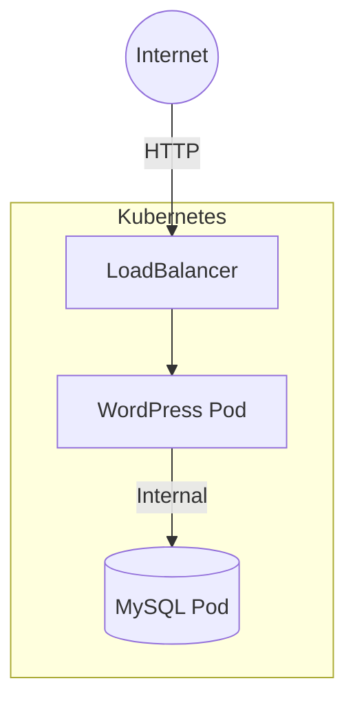
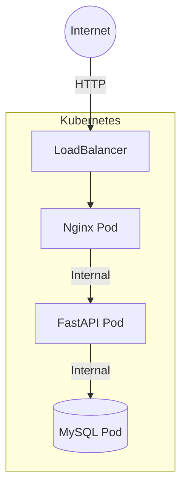

# 🏗️ Day 3: Application Architecture

Kubernetes 환경에서의 2-Tier 및 3-Tier 아키텍처 구성 프로젝트입니다.

## 📚 목차

1. [2-Tier Architecture](#1-2-tier-architecture) (WordPress + MySQL)
2. [3-Tier Architecture](#2-3-tier-architecture) (Nginx + FastAPI + MySQL)
3. [Advanced Integration](#3-advanced-integration) (CI/CD & Security)

---

## 1. 2-Tier Architecture

**구성**: WordPress(Web/App) + MySQL(DB)
- 단일 네임스페이스 구성
- LoadBalancer를 통한 외부 접근

👉 **[상세 가이드 보러가기](./2-tier/README.md)**

---

## 2. 3-Tier Architecture

**구성**: Nginx(Web) + FastAPI(Was) + MySQL(DB)
- 네임스페이스 분리 (보안 강화)
- 마이크로서비스 아키텍처 지향

👉 **[상세 가이드 보러가기](./3-tier/README.md)**

---

## 3. Advanced Integration

CI/CD 파이프라인 및 보안 강화 설정입니다.

- **GitLab Runner**: [로컬 빌드 환경 구축 가이드](./gitlab-self-hosted-Runner-cicd/README.md)
- **CI/CD Pipeline**: [GitHub Actions + GitLab CI 통합 구조](../../.github/workflows/README.md)
- **Container Security**: [Trivy 취약점 스캔 가이드](../day4-1218/ci-trivy/README.md)
