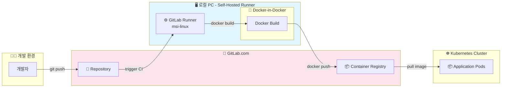

# GitLab Self-Hosted Runner CI/CD 구축 가이드

## 📚 목차

- [개요](#개요)
- [아키텍처](#아키텍처)
- [Runner 등록](#runner-등록)
- [Runner 설정 최적화](#runner-설정-최적화-configtoml)
- [Docker-in-Docker TLS 설정](#docker-in-docker-tls-설정)
- [CI/CD 파이프라인 구성](#cicd-파이프라인-구성)
- [TLS vs Non-TLS 비교](#tls-vs-non-tls-비교)
- [트러블슈팅](#트러블슈팅)
- [운영 명령어](#운영-명령어)

---

## 개요

### 문제점
- GitLab 무료 플랜은 월 400분의 CI/CD 시간 제한

### 해결책
- 로컬 PC에 GitLab Runner를 설치하여 무제한 빌드 환경 구축

### 구조 변화
| 항목 | 변경 전 | 변경 후 |
|------|--------|--------|
| 빌드 환경 | GitLab 공용 서버 (400분 제한) | 로컬 PC (무제한) |
| 레지스트리 | GitLab Container Registry | 동일 |

---

## 아키텍처



### 핵심 포인트
- GitLab.com에서 CI 트리거 → 로컬 Runner가 작업 수행
- Docker-in-Docker로 이미지 빌드
- 빌드된 이미지는 GitLab Container Registry에 푸시
- Kubernetes가 Registry에서 이미지 Pull

---

## Runner 등록

### 1. GitLab에서 토큰 발급

1. GitLab 프로젝트 → **Settings > CI/CD**
2. **Runners** 섹션 Expand
3. **New project runner** 클릭
4. Tags 입력 (예: `msi-linux`)
5. `glrt-`로 시작하는 토큰 복사

### 2. 로컬에서 Runner 등록

```bash
sudo gitlab-runner register
```

| 항목 | 입력 값 |
|------|--------|
| GitLab instance URL | `https://gitlab.com` |
| Authentication token | 복사한 토큰 |
| Description | `pista-registry` |
| Tags | `msi-linux` |
| Executor | `docker` |
| Default Docker image | `docker:latest` |

### 3. 등록 확인

```bash
sudo gitlab-runner verify
# 결과: Verifying runner... is alive
```

---

## Runner 설정 최적화 (config.toml)

**파일 위치**: `/etc/gitlab-runner/config.toml`

### 전체 설정

```toml
concurrent = 4
check_interval = 3

[[runners]]
  name = "pista-registry"
  url = "https://gitlab.com"
  executor = "docker"
  [runners.docker]
    tls_verify = false
    image = "docker:27.4.0"
    privileged = true
    disable_entrypoint_overwrite = false
    oom_kill_disable = false
    disable_cache = false
    volumes = ["/cache", "/certs:/certs"]
    shm_size = 0
    network_mtu = 1400
    environment = ["DOCKER_TLS_CERTDIR=/certs"]
```

### 핵심 설정 설명

| 항목 | 값 | 설명 |
|------|-----|------|
| `concurrent` | `4` | 동시 작업 수 |
| `check_interval` | `3` | 작업 요청 주기 (초) |
| `privileged` | `true` | DinD 실행에 필수 |
| `network_mtu` | `1400` | K8s 환경 네트워크 안정화 |
| `volumes` | `["/cache", "/certs:/certs"]` | 인증서 공유 볼륨 |
| `environment` | `["DOCKER_TLS_CERTDIR=/certs"]` | DinD에 TLS 활성화 지시 |

### 설정 적용

```bash
sudo systemctl restart gitlab-runner
```

---

## Docker-in-Docker TLS 설정

### 작동 원리

```
1. Runner가 DinD 서비스 컨테이너 시작
2. DinD가 /certs 디렉토리에 TLS 인증서 자동 생성
3. volumes 설정으로 job 컨테이너와 /certs 공유
4. Docker CLI가 /certs/client 인증서로 2376 포트에 TLS 연결
5. 빌드 & 푸시 실행
```

### 환경변수 설명

| 변수 | 값 | 설명 |
|------|-----|------|
| `DOCKER_TLS_CERTDIR` | `/certs` | 인증서 저장 경로 |
| `DOCKER_HOST` | `tcp://docker:2376` | TLS 포트 |
| `DOCKER_CERT_PATH` | `/certs/client` | 클라이언트 인증서 경로 |
| `DOCKER_TLS_VERIFY` | `1` | TLS 검증 활성화 |

---

## CI/CD 파이프라인 구성

### 전역 변수

```yaml
variables:
  DOCKER_TLS_CERTDIR: "/certs"
  DOCKER_HOST: "tcp://docker:2376"
  DOCKER_CERT_PATH: "/certs/client"
  DOCKER_TLS_VERIFY: "1"
  DOCKER_DRIVER: overlay2
```

### 공통 템플릿

```yaml
.default-docker-build:
  stage: build
  image: docker:27.4.0
  tags:
    - msi-linux
  services:
    - name: docker:27.4.0-dind
      alias: docker
  before_script:
    - echo "Waiting for Docker daemon..."
    - sleep 5
    - until docker info >/dev/null 2>&1; do sleep 1; done
    - docker login -u "$CI_REGISTRY_USER" -p "$CI_REGISTRY_PASSWORD" "$CI_REGISTRY"
```

### 변경 감지 빌드 (rules + changes)

```yaml
build-3tier-fastapi:
  extends: .default-docker-build
  script:
    - cd "on-premise-ict/day3-1217/3-tier/fastapi"
    - docker build -t "$TIER3_FASTAPI_IMAGE:$CI_COMMIT_SHORT_SHA" .
    - docker push "$TIER3_FASTAPI_IMAGE:$CI_COMMIT_SHORT_SHA"
  rules:
    - if: $CI_COMMIT_BRANCH == "main" || $CI_COMMIT_BRANCH == "feat/on-premise-ict"
      changes:
        - "on-premise-ict/day3-1217/3-tier/fastapi/**/*"
```

> **`/**/*`**: 해당 폴더의 모든 하위 폴더와 파일을 재귀적으로 감시

---

## TLS vs Non-TLS 비교

| 항목 | TLS (보안) | Non-TLS (간단) |
|------|-----------|----------------|
| 포트 | 2376 | 2375 |
| `DOCKER_TLS_CERTDIR` | `/certs` | `""` |
| `DOCKER_TLS_VERIFY` | `1` | `""` |
| `volumes` | `/certs:/certs` | `/cache`만 |
| 보안 | ✅ 암호화 통신 | ⚠️ 평문 통신 |

---

## 트러블슈팅

| 에러 | 원인 | 해결 |
|------|------|------|
| `request_concurrency=1 causing job delays` | 동시 작업 제한 | `concurrent = 4` |
| `connection reset by peer` | MTU 패킷 크기 문제 | `network_mtu = 1400` |
| `Cannot link to a non running container` | dind 권한 부족 | `privileged = true` |
| `Cannot connect to Docker daemon at tcp://docker:2375` | TLS 미설정 | 2376 포트 + 인증서 설정 |
| `invalid TLS configuration: could not load X509 key pair` | 인증서 볼륨 미설정 | `volumes`에 `/certs:/certs` 추가 |
| `open /certs/client/ca.pem: no such file or directory` | 글로벌 변수 충돌 | TLS 변수 일관되게 설정 |
| `docker info` 무한 대기 | DinD 시작 실패 | `privileged: true` 확인, 로그 확인 |
| Health check 경고 | DinD 늦게 시작 | 무시 가능 (`sleep 5`로 대기) |

---

## 운영 명령어

### 서비스 관리

```bash
# 재시작
sudo systemctl restart gitlab-runner

# 상태 확인
sudo systemctl status gitlab-runner

# 실시간 로그
sudo journalctl -u gitlab-runner -f
```

### Runner 관리

```bash
# 등록된 Runner 목록
sudo gitlab-runner list

# 연결 상태 확인
sudo gitlab-runner verify

# 네트워크 테스트
curl -v https://gitlab.com
```

---

## 최종 결과

- GitLab 400분 제한 **완전 회피**
- 로컬 자원으로 **무제한 빌드**
- 변경된 폴더만 빌드하여 **자원 효율화**
- TLS 인증서로 **보안 통신** 확보
