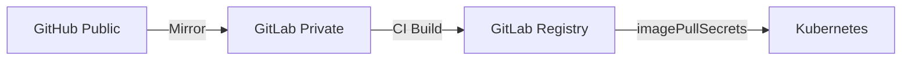
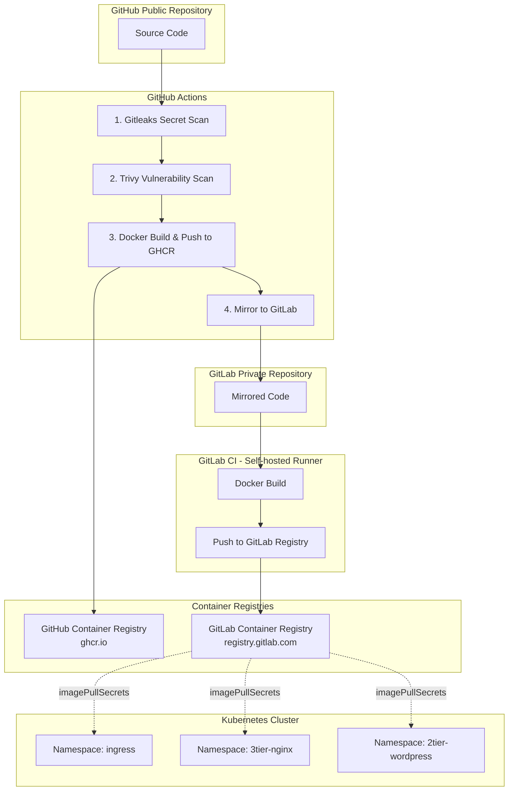

# Day 4 - Ingress-Nginx & GitHub + GitLab 하이브리드 구성

## 📚 목차

- [개요](#개요)
- [주요 실습](#주요-실습)
- [아키텍처](#아키텍처)
- [Ingress-Nginx 구성](#ingress-nginx-구성)
- [GitHub Public + GitLab Private](#github-public--gitlab-private)
- [Container Security](#container-security)

---

## 개요

Day 4에서는 Kubernetes Ingress-Nginx 서비스 구성과 GitHub-GitLab 하이브리드 CI/CD를 다룹니다.

| 주제 | 설명 |
|------|------|
| **Ingress-Nginx** | Kubernetes 진입점 역할의 웹 서버 |
| **NodePort** | 외부 접속을 위한 서비스 타입 |
| **GitHub Public + GitLab Private** | 코드는 공개, 이미지는 비공개 |
| **Container Security** | Trivy를 통한 취약점 스캔 자동화 |

---

## 주요 실습

### 1️⃣ Ingress-Nginx

Kubernetes 클러스터 외부에서 접근 가능한 Nginx 웹 서버를 구성합니다.


**핵심 개념:**
- **NodePort (30080)**: 클러스터 외부에서 접속하기 위한 포트
- **Deployment (replicas: 3)**: 고가용성을 위한 3개의 Pod
- **Baked-in Image**: ConfigMap 없이 이미지에 직접 파일 포함

> 📖 상세: [Ingress-Nginx 가이드](./ingress/nginx/README.md)

### 2️⃣ GitHub Public + GitLab Private

오픈소스 협업은 GitHub에서, 프라이빗 CI/CD는 GitLab에서 수행합니다.



> 📖 상세: [GitHub + GitLab 하이브리드 가이드](./github-public+gitlab-private/README.md)

### 3️⃣ Trivy 보안 스캔

CI/CD 파이프라인에서 컨테이너 취약점을 자동으로 검사합니다.

> 📖 상세: [Trivy 보안 가이드](./ci-trivy/README.md)

---

## 아키텍처

### 전체 CI/CD 흐름



---

## Ingress-Nginx 구성

### 디렉토리 구조

```
on-premise-ict/day4-1218/ingress/nginx/
├── Dockerfile          # Alpine 기반 Nginx 이미지
├── default.conf        # Nginx 서버 설정
├── index.html          # MyHome 정적 페이지
├── nginx.yaml          # Kubernetes 매니페스트
└── README.md           # 상세 문서
```

### Kubernetes 리소스

| 리소스 | 이름 | 설명 |
|--------|------|------|
| Namespace | `ingress` | 격리된 네임스페이스 |
| Secret | `gitlab-registry-secret` | GitLab Registry 인증 |
| Deployment | `nginx-deploy` | Nginx Pod 3개 배포 |
| Service | `nginx-svc` | NodePort 30080 |

### 배포 방법

```bash
# 1. Secret에 사용할 Docker 설정 Base64 인코딩
export DOCKER_CONFIG_JSON_BASE64=$(cat ~/.docker/config.json | base64 -w 0)

# 2. 환경 변수를 적용하여 배포
envsubst < ingress/nginx/nginx.yaml | kubectl apply -f -

# 3. 배포 확인
kubectl get pods -n ingress
kubectl get svc -n ingress
```

### 접속

```bash
# NodeIP 확인
kubectl get nodes -o wide

# 웹 브라우저에서 접속
http://<NodeIP>:30080
```

> 📖 상세 가이드: [Ingress-Nginx README](./ingress/nginx/README.md)

---

## GitHub Public + GitLab Private

### 왜 하이브리드 구성인가?

| 플랫폼 | 가시성 | 용도 | 장점 |
|--------|--------|------|------|
| **GitHub** | Public | 코드 공개, 오픈소스 협업 | 높은 접근성, 커뮤니티 활용 |
| **GitLab** | Private | CI/CD, Container Registry | 보안 유지, 비공개 이미지 |

### 핵심 포인트

- ✅ **코드는 공개** - GitHub Public Repository
- ✅ **이미지는 비공개** - GitLab Private Registry
- ✅ **자동 동기화** - GitHub Actions Mirror Job
- ✅ **imagePullSecrets** - Kubernetes에서 Private Registry 접근

### 워크플로우

1. **개발자가 GitHub에 Push**
2. **GitHub Actions 실행**
   - Gitleaks Secret 스캔
   - Trivy 취약점 스캔
   - Docker 빌드 → GHCR 푸시
   - GitLab으로 미러링
3. **GitLab CI 실행** (Self-hosted Runner)
   - Docker 빌드
   - GitLab Registry에 푸시
4. **Kubernetes 배포**
   - Secret을 사용하여 Private 이미지 Pull
   - Pod 생성 및 실행

> 📖 상세: [하이브리드 구성 가이드](./github-public+gitlab-private/README.md)

---

## Container Security

### Trivy 취약점 스캔

CI/CD 파이프라인에 통합된 보안 스캔으로 안전한 이미지만 배포합니다.

**스캔 대상:**
- 2-Tier: WordPress, MySQL
- 3-Tier: Nginx, FastAPI, MySQL
- Ingress: Nginx

**스캔 설정:**
```yaml
- name: Trivy Scan
  uses: aquasecurity/trivy-action@master
  with:
    image-ref: scan:nginx
    format: 'table'
    severity: 'HIGH,CRITICAL'
    exit-code: '1'
    trivyignores: '.trivyignore'
```

**실패 조건:**
- HIGH 또는 CRITICAL 취약점 발견 시 빌드 실패
- `.trivyignore`에 등록된 CVE는 무시

> 📖 상세: [Trivy 보안 가이드](./ci-trivy/README.md)

---

## 관련 파일

| 파일 | 설명 |
|------|------|
| [ingress/nginx/](./ingress/nginx/) | Ingress-Nginx 전체 구성 |
| [github-public+gitlab-private/](./github-public+gitlab-private/) | 하이브리드 구성 가이드 |
| [ci-trivy/](./ci-trivy/) | Trivy 보안 스캔 가이드 |
| [.env](./ingress/.env) | 환경 변수 템플릿 |

---

## 다음 단계

1. ✅ Ingress-Nginx 배포 및 NodePort 접속 확인
2. ✅ GitHub Public 전환 및 GitLab Mirror 동작 확인
3. ✅ Trivy 스캔 파이프라인 검증
4. 🔄 Production 환경을 위한 LoadBalancer 구성 (선택)
