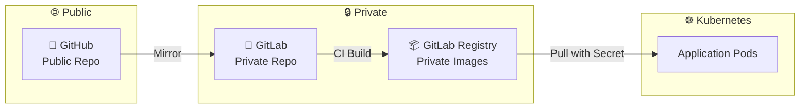

# GitHub Public + GitLab Private 구성 가이드

## 개요

GitHub는 Public 저장소로 운영하면서, GitLab은 Private 저장소 및 Private Container Registry로 운영하는 하이브리드 구성



> **Q: GitHub를 Public으로 전환하면 GitLab도 Public이 되나요?**  
> **A: 아니요.** GitHub와 GitLab은 독립적입니다. GitHub가 Public이어도 GitLab은 Private으로 유지됩니다.

---

## 이점

| 항목 | GitHub Public | GitLab Private |
|------|---------------|----------------|
| 코드 가시성 | 누구나 열람 가능 | 인증된 사용자만 접근 |
| Container Registry | - | 인증 필요 |
| CI/CD 비용 | 제한적 | Self-hosted Runner로 무제한 |
| 협업 | 오픈소스 기여 가능 | 내부 팀만 접근 |

---

## 설정 방법

### 1. GitLab Private Repository 생성

```bash
# GitLab에서 새 프로젝트 생성 시
Visibility Level: Private 선택
```

### 2. GitHub Actions Mirror 설정

`.github/workflows/mirror.yml`:

```yaml
name: Mirror to GitLab

on:
  push:
    branches: ['*']

jobs:
  mirror:
    runs-on: ubuntu-latest
    steps:
      - uses: actions/checkout@v4
        with:
          fetch-depth: 0
      
      - name: Mirror to GitLab
        run: |
          git remote add gitlab https://oauth2:${{ secrets.GITLAB_TOKEN }}@gitlab.com/YOUR_USER/YOUR_REPO.git
          git push gitlab --all --force
          git push gitlab --tags --force
```

### 3. GitLab CI/CD 설정

`.gitlab-ci.yml`:

```yaml
stages:
  - build

variables:
  DOCKER_TLS_CERTDIR: "/certs"

build-image:
  stage: build
  image: docker:latest
  services:
    - docker:dind
  before_script:
    - docker login -u "$CI_REGISTRY_USER" -p "$CI_REGISTRY_PASSWORD" "$CI_REGISTRY"
  script:
    - docker build -t "$CI_REGISTRY_IMAGE:$CI_COMMIT_SHORT_SHA" .
    - docker push "$CI_REGISTRY_IMAGE:$CI_COMMIT_SHORT_SHA"
```

---

## Kubernetes에서 Private Registry 사용

### 1. Registry Secret 생성

```bash
kubectl create secret docker-registry gitlab-registry-secret \
  --docker-server=registry.gitlab.com \
  --docker-username=YOUR_GITLAB_USER \
  --docker-password=YOUR_GITLAB_TOKEN \
  --docker-email=YOUR_EMAIL \
  -n YOUR_NAMESPACE
```

### 2. Deployment에서 Secret 참조

```yaml
apiVersion: apps/v1
kind: Deployment
spec:
  template:
    spec:
      imagePullSecrets:
        - name: gitlab-registry-secret
      containers:
        - name: app
          image: registry.gitlab.com/YOUR_USER/YOUR_REPO:latest
```

---

## 보안 체크리스트

- [ ] GitLab Repository를 Private으로 설정
- [ ] GitLab Token을 GitHub Secrets에 안전하게 저장
- [ ] Kubernetes imagePullSecrets 설정
- [ ] GitLab Token 권한 최소화 (read_registry, write_registry)

---

## 참고

- [GitLab Container Registry 문서](https://docs.gitlab.com/ee/user/packages/container_registry/)
- [Kubernetes Private Registry 가이드](https://kubernetes.io/docs/tasks/configure-pod-container/pull-image-private-registry/)
