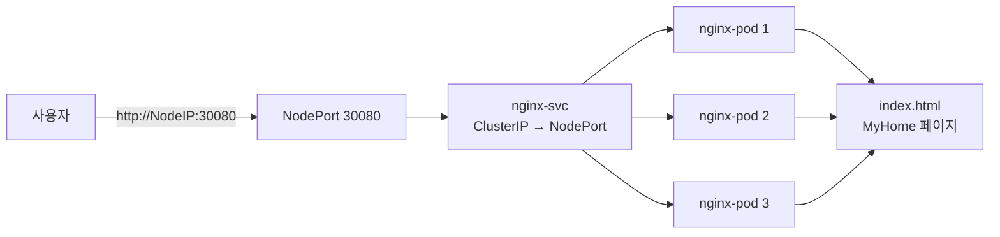

# Ingress-Nginx 구성

## 📚 목차

- [개요](#개요)
- [아키텍처](#아키텍처)
- [파일 구조](#파일-구조)
- [Docker 이미지](#docker-이미지)
- [Kubernetes 배포](#kubernetes-배포)
- [접속 방법](#접속-방법)
- [설정 파일](#설정-파일)

---

## 개요

Kubernetes 클러스터의 진입점 역할을 하는 **Ingress-Nginx** 서비스입니다.

| 항목 | 내용 |
|------|------|
| **베이스 이미지** | nginx:1.29.4-alpine |
| **네임스페이스** | ingress |
| **서비스 타입** | NodePort |
| **포트** | 30080 (외부 접속용) |
| **레플리카** | 3 |

---

## 아키텍처



---

## 파일 구조

```
on-premise-ict/day4-1218/ingress/nginx/
├── Dockerfile          # Nginx 이미지 빌드 정의
├── default.conf        # Nginx 서버 설정
├── index.html          # 정적 HTML 페이지
├── nginx.yaml          # Kubernetes 매니페스트
└── README.md           # 본 문서
```

---

## Docker 이미지

### Dockerfile

```dockerfile
FROM nginx:1.29.4-alpine
EXPOSE 80

COPY index.html /usr/share/nginx/html/
COPY default.conf /etc/nginx/conf.d/

CMD ["nginx", "-g", "daemon off;"]
```

**특징:**
- Alpine 기반 경량 이미지 사용
- 정적 파일을 이미지에 직접 포함 (Baked-in)
- ConfigMap 마운트 불필요

### 빌드 및 푸시

**로컬 빌드:**
```bash
docker build -t ingress-nginx:latest .
```

**CI/CD 자동 빌드:**
- GitLab CI: `registry.gitlab.com/pyh5523/pista-megazoncloud/ingress-nginx:latest`
- GitHub Actions: `ghcr.io/steelcrab/ingress-nginx:latest` (예정)

---

## Kubernetes 배포

### 리소스 구성

| 리소스 | 이름 | 설명 |
|--------|------|------|
| Namespace | ingress | 격리된 네임스페이스 |
| Secret | gitlab-registry-secret | GitLab Container Registry 인증 |
| Deployment | nginx-deploy | Nginx Pod 3개 배포 |
| Service | nginx-svc | NodePort 30080 노출 |

### 배포 명령어

**1. 환경 변수 설정**
```bash
# .dockerconfigjson을 Base64로 인코딩
export DOCKER_CONFIG_JSON_BASE64=$(cat ~/.docker/config.json | base64 -w 0)

# nginx.yaml에 적용
set -a && source .env && set +a && envsubst < nginx/nginx.yaml | kubectl apply -f -
```

**2. 배포 확인**
```bash
# 네임스페이스 확인
kubectl get ns ingress

# Pod 상태 확인
kubectl get pods -n ingress

# Service 확인
kubectl get svc -n ingress
```

**3. 배포 삭제**
```bash
kubectl delete -f nginx.yaml
```

---

## 접속 방법

### 외부에서 접속

```bash
# NodePort를 통한 접속
http://<NodeIP>:30080
```

**NodeIP 확인:**
```bash
kubectl get nodes -o wide
```

### 테스트

```bash
# curl로 확인
curl http://<NodeIP>:30080

# 예상 응답: MyHome HTML 페이지
```

---

## 설정 파일

### default.conf

```nginx
server {
    charset utf-8;
    listen 80;
    server_name localhost;

    location / {
        root /usr/share/nginx/html;
        index index.html;
    }
}
```

**주요 설정:**
- `charset utf-8`: 한글 문자 깨짐 방지
- `listen 80`: HTTP 기본 포트
- `root /usr/share/nginx/html`: 정적 파일 경로

### index.html

간단한 **MyHome** 페이지가 중앙에 표시됩니다.

**화면 구성:**
- 전체 화면 크기의 부모 컨테이너
- 중앙 정렬된 파란색 박스
- "MyHome" 텍스트

---

## Service 타입 변경

### ClusterIP → NodePort 변경 이유

| 타입 | 접근 범위 | 사용 사례 |
|------|----------|----------|
| ClusterIP | 클러스터 내부만 | 내부 통신용 (FastAPI, MySQL) |
| NodePort | 클러스터 외부 | 개발/테스트 환경에서 외부 노출 |
| LoadBalancer | 클라우드 외부 | 프로덕션 환경 (AWS, GCP, Azure) |

**온프레미스 환경**에서는 LoadBalancer가 없으므로 **NodePort**를 사용하여 외부 접속을 허용합니다.

---

## 트러블슈팅

### Pod이 ImagePullBackOff 상태

**원인:** GitLab Registry 인증 실패

**해결:**
```bash
# Secret 재생성
kubectl delete secret gitlab-registry-secret -n ingress
export DOCKER_CONFIG_JSON_BASE64=$(cat ~/.docker/config.json | base64 -w 0)
envsubst < nginx.yaml | kubectl apply -f -
```

### NodePort로 접속 불가

**확인 사항:**
1. 방화벽에서 30080 포트 허용 여부
2. Service에 ExternalIP가 없는 경우 → NodeIP 사용
3. Pod이 Running 상태인지 확인

```bash
kubectl get pods -n ingress
kubectl logs -n ingress <pod-name>
```

---

## 참고 링크

- [Nginx 공식 문서](https://nginx.org/en/docs/)
- [Kubernetes Service 타입](https://kubernetes.io/docs/concepts/services-networking/service/#publishing-services-service-types)
- [GitLab Container Registry](https://docs.gitlab.com/ee/user/packages/container_registry/)
