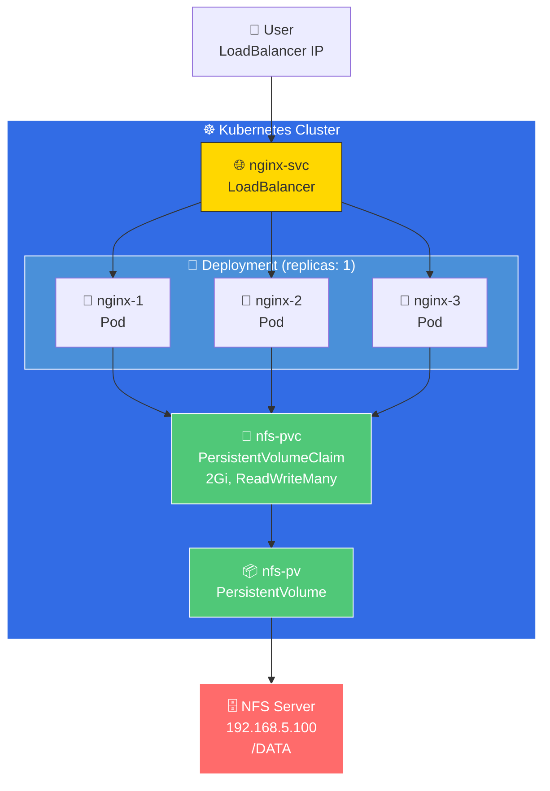

# 📂 NFS 파드 공유 볼륨 실습 (Day 5)

쿠버네티스 파드들이 **NFS(Network File System)**를 통해 데이터를 공유하는 방법을 실습합니다.

---

## 📑 목차

| 섹션 | 설명 |
|------|------|
| [🏗️ 아키텍처](#️-아키텍처) | 전체 구성 및 리소스 구조 |
| [🚀 사전 준비](#-사전-준비) | NFS 서버/클라이언트 설정 |
| [📦 구성 파일](#-구성-파일) | Dockerfile, nfs.yaml 설명 |
| [🛠️ 실행 및 검증](#️-실행-및-검증) | 배포, 테스트, 확인 방법 |
| [🧹 삭제](#-삭제) | 리소스 정리 |

---

## 🏗️ 아키텍처



| 구성요소 | 설명 |
|----------|------|
| **NFS Server** | 마스터 노드 `192.168.5.100`의 `/DATA` 공유 |
| **NFS Client** | 각 워커 노드 (`nfs-common` 필요) |
| **Namespace** | `nfs` |
| **PV/PVC** | 2Gi, `ReadWriteMany` 모드 |
| **Deployment** | Nginx 파드 1개 (볼륨 마운트) |
| **Service** | `LoadBalancer` |

---

## 🚀 사전 준비

### 1️⃣ NFS 서버 설정 (마스터 노드)

```bash
# 1. NFS 서버 패키지 설치
sudo apt update && sudo apt install nfs-kernel-server -y

# 2. 공유 디렉토리 생성 및 권한 설정
sudo mkdir -p /DATA
sudo chmod -R 777 /DATA
sudo chown nobody:nogroup /DATA

# 3. NFS 공유 설정
echo "/DATA *(rw,sync,no_subtree_check,no_root_squash)" | sudo tee -a /etc/exports

# 4. 설정 적용 및 서비스 재시작
sudo exportfs -ra
sudo systemctl restart nfs-kernel-server
```

### 2️⃣ NFS 클라이언트 설치 (모든 워커 노드 필수)

쿠버네티스 노드가 NFS를 마운트하기 위해 **모든 워커 노드**에 설치해야 합니다.

```bash
# 1. 각 노드에 직접 설치하거나
sudo apt update && sudo apt install nfs-common -y

# 2. 마스터 노드에서 SSH로 일괄 설치 시
for node in k8s-n1 k8s-n2 k8s-n3; do
  ssh $node "sudo apt update && sudo apt install nfs-common -y"
done
```

---

## 📦 구성 파일

### 📄 Dockerfile

```dockerfile
FROM nginx:1.29.4-alpine
EXPOSE 80
CMD ["nginx", "-g", "daemon off;"]
```

> 정적 파일 없이 빌드 → **NFS 볼륨에서 콘텐츠 제공**

### 📄 nginx.yaml

| 리소스 | 역할 |
|--------|------|
| `Namespace` | `nfs` 네임스페이스 생성 |
| `Secret` | GitLab Registry 인증 |
| `PersistentVolume` | NFS 서버 연결 (2Gi) |
| `PersistentVolumeClaim` | PV 요청 및 바인딩 |
| `Deployment` | Nginx 1개 파드, `/usr/share/nginx/html` 마운트 |
| `Service` | `LoadBalancer`로 포트 80 노출 |

---

## 🛠️ 실행 및 검증

### Step 1. 배포

```bash
set -a && source .env && set +a && envsubst < nginx.yaml | kubectl apply -f -

```

### Step 2. 리소스 확인

```bash
# 네임스페이스 확인
kubectl get all -n nfs

# PV/PVC 상태 확인
kubectl get pv,pvc
```

### Step 3. NFS 서버에 콘텐츠 생성

```bash
# 마스터 노드에서 실행
echo "<h1>Hello from NFS Shared Volume!</h1>" | sudo tee /DATA/index.html
```

### Step 4. 웹 접속 테스트

```bash
# 서비스 IP/URL 확인 후 접속
curl http://<Service_IP>
```

> [!IMPORTANT]
> 모든 파드가 **동일한 NFS 볼륨**을 공유하므로, `/DATA`의 파일 변경 시 **모든 파드에 즉시 반영**됩니다.

---

## 🛠️ 트러블슈팅 (핵심 요약)

실습 중 발생할 수 있는 주요 문제와 해결 방법입니다.

### 1. 파드가 `Pending` 상태 (Status: `unbound PVC`)
*   **원인**: PVC에 `namespace: nfs`가 없어서 `default` 네임스페이스에 생성됨.
*   **해결**: `nginx.yaml`에서 PVC의 `metadata.namespace`를 `nfs`로 명시.

### 2. PV가 `Terminating` 상태로 멈춤
*   **원인**: 이전 네임스페이스의 PVC가 PV를 물고 있어서 삭제가 안 됨.
*   **해결**: 
    1.  `kubectl delete pvc nfs-pvc -n default` (기존 PVC 제거)
    2.  안 사라질 경우 강제 삭제: `kubectl patch pv nfs-pv -p '{"metadata":{"finalizers":null}}'`

### 3. 파드 에러 `FailedMount` (exit status 32)
*   **원인**: 워커 노드에 NFS 클라이언트용 `nfs-common` 패키지가 없음.
*   **해결**: 모든 워커 노드에 `sudo apt install nfs-common -y` 설치.

### 4. 파드 에러 `FailedMount` (Connection refused)
*   **원인**: `nginx.yaml`의 PV 설정에 NFS 서버(마스터) IP가 틀림.
*   **해결**: `spec.nfs.server` IP를 마스터 노드 IP(`192.168.5.10`)로 수정.

---

## 🧹 리소스 삭제

```bash
kubectl delete -f nginx.yaml
```

> [!NOTE]
> `persistentVolumeReclaimPolicy: Retain` 설정으로 인해 PVC 삭제 후에도 **NFS 서버의 데이터는 보존**됩니다.
