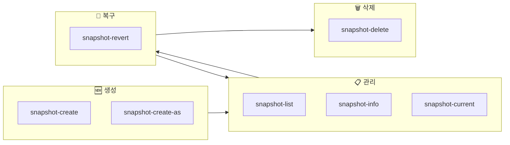
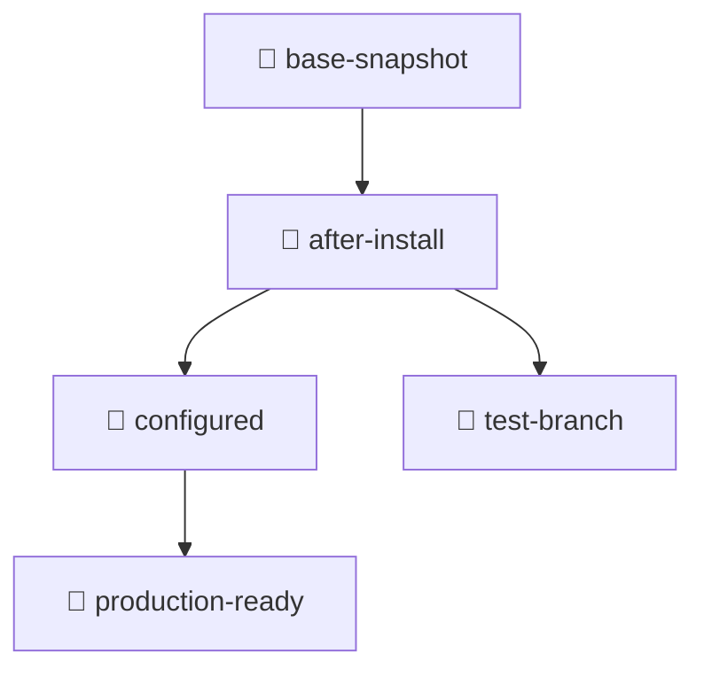

# 📸 libvirt virsh 스냅샷 명령어 가이드

libvirt의 virsh를 이용한 스냅샷 관련 모든 주요 명령어를 카테고리별로 정리합니다.

---

## 1. 🆕 스냅샷 생성 (Create)

### 기본 생성 (자동 명명)
```bash
virsh snapshot-create [VM_이름]
```
시스템이 자동으로 생성 시간을 이름으로 정하여 스냅샷을 만듭니다.

### 이름 지정 생성 (권장) ⭐
```bash
virsh snapshot-create-as [VM_이름] --name [이름] --description "[설명]"
```
사용자가 원하는 이름과 설명을 붙여 가독성을 높입니다.

### 디스크 전용 스냅샷 (Disk Only)
```bash
virsh snapshot-create-as [VM_이름] [이름] --disk-only
```
메모리 덤프 없이 디스크 변경 사항만 기록하여 생성 속도가 빠릅니다.

### 라이브 스냅샷
```bash
virsh snapshot-create-as [VM_이름] [이름] --live
```
실행 중인 VM의 중단 시간을 최소화하며 상태를 저장합니다.

---

## 2. 📋 스냅샷 조회 및 정보 (List & Info)

### 전체 목록 확인
```bash
virsh snapshot-list [VM_이름]
```

### 트리 구조 확인 (계층 구조) 🌲
```bash
virsh snapshot-list [VM_이름] --tree
```
어떤 스냅샷에서 파생되었는지 부모-자식 관계를 시각적으로 보여줍니다.

### 상세 정보 출력
```bash
virsh snapshot-info [VM_이름] --snapshotname [이름]
```

### 현재 활성화된 스냅샷 확인
```bash
virsh snapshot-current [VM_이름]
```

---

## 3. 🔄 스냅샷 복구 및 전환 (Revert)

### 특정 시점으로 복구
```bash
virsh snapshot-revert [VM_이름] --snapshotname [이름]
```
VM의 상태를 지정한 스냅샷 시점으로 즉시 되돌립니다.

### 실행 상태로 복구
```bash
virsh snapshot-revert [VM_이름] [이름] --running
```
복구 후 VM을 자동으로 시작 상태로 만듭니다.

### 일시정지 상태로 복구
```bash
virsh snapshot-revert [VM_이름] [이름] --paused
```

---

## 4. 🗑️ 스냅샷 삭제 (Delete)

### 특정 스냅샷만 삭제
```bash
virsh snapshot-delete [VM_이름] --snapshotname [이름]
```

### 자식 스냅샷까지 일괄 삭제 ⚠️
```bash
virsh snapshot-delete [VM_이름] [이름] --children
```
지정한 스냅샷과 그 이후에 파생된 모든 스냅샷을 함께 지웁니다.

### 메타데이터만 삭제
```bash
virsh snapshot-delete [VM_이름] [이름] --metadata
```
실제 디스크 이미지는 유지하고 libvirt 내부 기록만 제거합니다.

---

## 5. 🛠️ 기타 관리

### 스냅샷 XML 덤프
```bash
virsh snapshot-dumpxml [VM_이름] [이름]
```
특정 스냅샷의 설정 내용을 XML 파일로 추출합니다.

### 스냅샷 정의 (가져오기)
```bash
virsh snapshot-create [VM_이름] [XML_파일]
```
기존에 백업해둔 XML 설정을 통해 스냅샷 정보를 복구합니다.

---

## 📊 스냅샷 생명주기 다이어그램



---

## 🌲 스냅샷 트리 구조 예시



> [!TIP]
> `virsh snapshot-list [VM_이름] --tree` 명령으로 실제 트리 구조를 확인할 수 있습니다.

---

## 📝 실전 예제

```bash
# 1. VM 목록 확인
virsh list --all

# 2. 스냅샷 생성
virsh snapshot-create-as myvm --name "before-update" --description "업데이트 전 백업"

# 3. 스냅샷 목록 확인
virsh snapshot-list myvm --tree

# 4. 문제 발생 시 복구
virsh snapshot-revert myvm --snapshotname "before-update" --running

# 5. 더 이상 필요없는 스냅샷 삭제
virsh snapshot-delete myvm --snapshotname "before-update"
```
