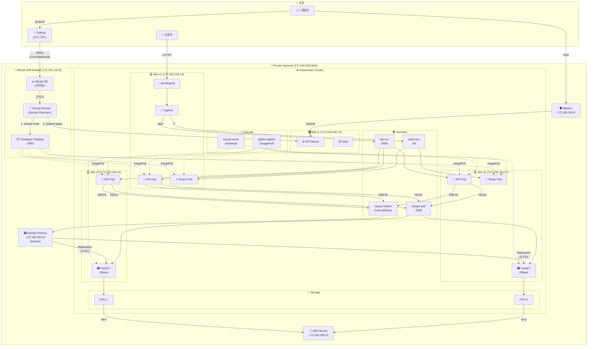

# Day 2 - 3-Tier 애플리케이션 배포 (12/29)

> Day 1에서 구축한 인프라 위에 실제 애플리케이션 배포

## 📋 목차

1. [📌 개요](#-개요)
2. [📁 Day 1 완료 상태 확인](#-day-1-완료-상태-확인)
3. [🔑 Secrets 관리](#-secrets-관리)
4. [🚀 3-Tier 애플리케이션 배포](#-3-tier-애플리케이션-배포)
5. [🔄 CI/CD 파이프라인 구성](#-cicd-파이프라인-구성)
6. [📊 모니터링 설정](#-모니터링-설정)
7. [⚠️ 트러블슈팅](#️-트러블슈팅)

---

## 📰 Day 1 참조 목차

> 📰 [Day 1 - 3-Tier 인프라 구축](../day1-1224/install-3tier/README.md)

| # | 섹션 | 설명 |
|---|------|------|
| 1 | [🗄️ 개요](../day1-1224/install-3tier/README.md#🗄️-개요) | VMware 3-Tier 아키텍처 개요 |
| 2 | [🏗️ 인프라 구성](../day1-1224/install-3tier/README.md#🏗️-인프라-구성) | 전체 VM 구성표 |
| 3 | [🏢 Base VM 준비](../day1-1224/install-3tier/README.md#🏢-base-vm-준비) | 기본 패키지, VM 클론 워크플로 |
| 4 | [🖥️ Bastion Host 구성](../day1-1224/install-3tier/README.md#🖥️-bastion-host-구성) | 게이트웨이, IP 포워딩, iptables |
| 5 | [🔌 NFS System 구성](../day1-1224/install-3tier/README.md#🔌-nfs-system-구성) | NFS 서버 설치, 마운트 설정 |
| 6 | [🗃️ MySQL 구성](../day1-1224/install-3tier/README.md#🗃️-mysql-구성) | Docker Compose, MySQL Master |
| 7 | [⚙️ k8s-m 설정](../day1-1224/install-3tier/README.md#⚙️-k8s-m-설정) | 마스터 노드 설정, containerd, kubeadm |
| 8 | [🔄 k8s-n1,n2,n3 클론](../day1-1224/install-3tier/README.md#🔄-k8s-n1n2n3-클론-vmware) | 워커 노드 클론, NFS 마운트 |
| 9 | [📡 Ingress Controller 구성](../day1-1224/install-3tier/README.md#📡-ingress-controller-구성) | Helm, Ingress-NGINX 설치 |
| 10 | [🔗☸ MetalLB 구성](../day1-1224/install-3tier/README.md#🔗☸-metallb-구성) | LoadBalancer IP Pool |
| 11 | [🦊 GitLab Self-Hosted Runner](../day1-1224/install-3tier/README.md#🦊-gitlab-self-hosted-runner-구축) | GitLab CE, Runner 설치 |
| 12 | [⚙️ Kubeconfig 설정](../day1-1224/install-3tier/README.md#⚙️-kubeconfig-설정) | GitLab ↔ K8s 연동 |
| 13 | [🔐 SSH 터널링 설정](../day1-1224/install-3tier/README.md#🔐-ssh-터널링-설정) | Jump Host 설정 |
| 14 | [🔄 GitLab Mirror 동기화](../day1-1224/install-3tier/README.md#🔄-gitlab-mirror-동기화) | Cloud ↔ Self-Hosted 동기화 |
| 15 | [🏢 Container Registry 설정](../day1-1224/install-3tier/README.md#🏢-container-registry-설정) | Private Registry, K8s Secret |
| 16 | [⚠️ 오류 해결](../day1-1224/install-3tier/README.md#⚠️-오류-해결) | SSH, Docker Registry 오류 |

---

## 📌 개요

Day 1에서 구축한 VMware 기반 3-Tier 인프라 위에 실제 애플리케이션을 배포합니다.

### 🏗️ 전체 아키텍처



### 📁 IP 정리

| 서버 | IP | 역할 |
|------|-----|------|
| 🦊 GitLab | 172.100.100.8 | Git, CI/CD, Registry |
| 🛡️ Bastion | 172.100.100.9 | SSH 게이트웨이 |
| 💾 NFS | 172.100.100.10 | 공유 스토리지 |
| 🗃️ MySQL | 172.100.100.11 | Primary (쓰기) |
| 🎛️ k8s-m | 172.100.100.12 | Master (Control Plane) |
| 💻 k8s-n1 | 172.100.100.13 | Worker Node 1 |
| 💻 k8s-n2 | 172.100.100.14 | Worker Node 2 |
| 💻 k8s-n3 | 172.100.100.15 | Worker Node 3 |

### ✅ Day 1 구축 완료

- ✅ Bastion Host (172.100.100.9)
- ✅ NFS Server (172.100.100.10)
- ✅ MySQL Master (172.100.100.11)
- ✅ Kubernetes Cluster (k8s-m, k8s-n1~n3)
- ✅ GitLab Self-Hosted + Runner (172.100.100.8)
- ✅ Ingress Controller + MetalLB

### 📌 Day 2 목표

| # | 구성 요소 | 설명 |
|---|----------|------|
| 1 | 🗃️ MySQL StatefulSet | Slave 복제본 (mysql-0, mysql-1) |
| 2 | 🐍 Python API | FastAPI 백엔드 (3 replicas) |
| 3 | ⚛️ React + Nginx | 프론트엔드 (2 replicas) |
| 4 | 📚 Services | api-svc, react-svc, mysql-read, mysql-write |
| 5 | 🚪 Ingress | 경로 기반 라우팅 (/api/*, /*) |
| 6 | 🔄 CI/CD | GitLab → Registry → K8s 자동 배포 |

---

## 📁 Day 1 완료 상태 확인

```bash
# k8s-m에서 실행

# 1. 클러스터 노드 상태
kubectl get nodes -o wide

# 2. 시스템 Pod 상태
kubectl get pods -A

# 3. NFS 서버 상태
ssh nfs "showmount -e localhost"

# 4. MySQL Master 상태
ssh mysql "docker ps"
```

---

## 🔐 Secrets 관리

> 이 프로젝트에서 사용되는 모든 Kubernetes Secrets 목록

### 📁 Secrets 목록

| Secret 이름 | Namespace | 용도 | 만료/갱신 |
|------------|-----------|------|----------|
| `gitlab-registry` | gition | Container Registry 인증 (imagePullSecrets) | 1년 (수동 갱신) |
| `mysql-secret` | gition | MySQL root/repl 비밀번호 | 만료 없음 |

### 🔄 갱신 방법

#### gitlab-registry (Registry Token 갱신)

```bash
# 1. GitLab에서 새 토큰 발급 (기존 토큰 만료 시)
sudo gitlab-rails console
```

```ruby
# Rails 콘솔에서
user = User.find_by(username: 'root')
token = user.personal_access_tokens.create(
  name: 'k8s-registry-renewed',
  scopes: [:read_registry, :write_registry],
  expires_at: 1.year.from_now
)
puts token.token
exit
```

```bash
# 2. K8s Secret 삭제 후 재생성
kubectl delete secret gitlab-registry -n gition
kubectl create secret docker-registry gitlab-registry \
  --docker-server=172.100.100.8:5050 \
  --docker-username=root \
  --docker-password=<NEW_TOKEN> \
  -n gition

# 3. Pod 재시작 (새 Secret 적용)
kubectl rollout restart deployment/fastapi deployment/react -n gition
```

#### mysql-secret (비밀번호 변경 시)

```bash
# 1. Secret 삭제 후 재생성
kubectl delete secret mysql-secret -n gition
kubectl create secret generic mysql-secret \
  --from-literal=root-password=<NEW_ROOT_PASSWORD> \
  --from-literal=repl-password=<NEW_REPL_PASSWORD> \
  -n gition

# 2. StatefulSet 재시작
kubectl rollout restart statefulset/mysql -n gition
```

> [!WARNING]
> MySQL 비밀번호 변경 시 Replication 재설정 필요!

---

## 🚀 3-Tier 애플리케이션 배포

### 🔐 GitLab Registry Secret 설정 (필수)

Self-hosted GitLab Registry(`172.100.100.8:5050`)에서 이미지를 Pull하려면 K8s에 인증 정보가 필요합니다.

#### 1. GitLab Registry Token 발급

```bash
# GitLab VM (172.100.100.8)에서 실행
sudo gitlab-rails console
```

```ruby
# Rails 콘솔에서 실행
user = User.find_by(username: 'root')
token = user.personal_access_tokens.create(
  name: 'k8s-registry',
  scopes: [:read_registry, :write_registry],
  expires_at: 1.year.from_now
)
puts token.token  # 토큰 복사
exit
```

#### 2. K8s에 Registry Secret 생성

```bash
# k8s-m에서 실행

# 1. Namespace 생성
kubectl create namespace gition

# 2. Registry Secret 생성
kubectl create secret docker-registry gitlab-registry \
  --docker-server=172.100.100.8:5050 \
  --docker-username=root \
  --docker-password=<REGISTRY_TOKEN> \
  -n gition

# 3. Secret 확인
kubectl get secret gitlab-registry -n gition
```

#### 3. 모든 K8s 노드에 insecure-registries 설정

```bash
# k8s-m에서 모든 노드에 일괄 적용
for node in k8s-m k8s-n1 k8s-n2 k8s-n3; do
  ssh $node "sudo tee /etc/docker/daemon.json > /dev/null <<EOF
{
  \"insecure-registries\": [\"172.100.100.8:5050\"]
}
EOF
sudo systemctl restart docker"
done
```

> [!IMPORTANT]
> HTTP Registry 사용 시 모든 K8s 노드에 `insecure-registries` 설정 필수!

---

### 💾 NFS StorageClass 설정 (필수)

MySQL StatefulSet의 PVC를 위해 NFS Provisioner가 필요합니다.

> **NFS Provisioner란?**
> - K8s에서 PVC 요청 시 자동으로 NFS 서버에 디렉토리를 생성하고 PV를 만들어주는 컴포넌트
> - StatefulSet의 다이나믹한 볼륨 수동 PV 생성 없이 자동으로 스토리지 할당
> - `StorageClass`를 통해 동적 프로비저닝 (Dynamic Provisioning) 지원

```bash
# NFS Provisioner 배포
kubectl apply -f k8s/nfs-provisioner.yaml

# StorageClass 확인 (nfs-client가 default로 설정됨)
kubectl get storageclass
```

> [!NOTE]
> Helm으로 설치하려면: `helm install nfs-provisioner nfs-subdir-external-provisioner/nfs-subdir-external-provisioner --set nfs.server=172.100.100.10 --set nfs.path=/mnt/DATA`

---

### MySQL Slave 구성

#### mysql-secret 상세

MySQL Slave Pod가 사용하는 비밀번호를 저장한 Secret입니다.

```
┌─────────────────────────────────────────────────────────────────────┐
│                   mysql-secret                                      │
├─────────────────────────────────────────────────────────────────────┤
│ root-password  │ MySQL Slave의 root 비밀번호                       │
│ repl-password  │ Master ↔ Slave 복제 접속 시 사용                  │
└─────────────────────────────────────────────────────────────────────┘
          │                         │
          │                         │
   ┌────────────────┐          ┌─────────────────────────┐
   │ mysql-0        │          │ MySQL Primary           │
   │ mysql-1        │←────────→│ (172.100.100.11)        │
   │ (Slave)        │ GTID복제 │ (Master)                │
   └────────────────┘          └─────────────────────────┘
```

| 키 | 용도 | 주의사항 |
|---|------|----------|
| `root-password` | MySQL Slave Pod root 계정 | Primary의 root 비밀번호와 **동일하게** |
| `repl-password` | Master 복제 접속용 | Primary의 `repl_pista` 계정 비밀번호와 **동일하게** |
| `user-password` | 애플리케이션 DB 사용자(pista) | 앱에서 DB 접속 시 사용 |

#### 배포 순서

```bash
# 1. MySQL Secret 생성
kubectl create secret generic mysql-secret \
  --from-literal=root-password=<YOUR_PASSWORD> \
  --from-literal=repl-password=<REPL_PASSWORD> \
  --from-literal=user-password=<USER_PASSWORD> \
  -n gition

# 2. MySQL Slave StatefulSet 배포
kubectl apply -f k8s/mysql-slave.yaml
```

### FastAPI 백엔드 배포

```bash
kubectl apply -f k8s/fastapi-deployment.yaml
```

### React 프론트엔드 배포

```bash
kubectl apply -f k8s/react-deployment.yaml
```

### Ingress 구성

```bash
kubectl apply -f k8s/ingress.yaml
```

---

### 🔄 MySQL Replication 초기화

MySQL Slave Pod가 배포된 후 Master-Slave 복제를 설정합니다.

```bash
# 스크립트 실행 권한 부여
chmod +x scripts/init-replication.sh

# 환경 변수 설정 후 실행
export MYSQL_ROOT_PASSWORD=<YOUR_PASSWORD>
export MYSQL_REPL_PASSWORD=<REPL_PASSWORD>
./scripts/init-replication.sh
```

#### 수동 설정 (개별 Pod)

```bash
# mysql-0 Pod에서 실행
kubectl exec -it mysql-0 -n gition -- mysql -uroot -p

# MySQL 콘솔에서
CHANGE MASTER TO
  MASTER_HOST='172.100.100.11',
  MASTER_USER='repl_pista',
  MASTER_PASSWORD='<REPL_PASSWORD>',
  MASTER_AUTO_POSITION=1;

START SLAVE;
SHOW SLAVE STATUS\G
```

> [!TIP]
> `Slave_IO_Running: Yes`, `Slave_SQL_Running: Yes` 확인 필수!

---

### 🔚 파일 구조

| 경로 | 설명 |
|------|------|
| **k8s/** | Kubernetes 매니페스트 |
| [nfs-provisioner.yaml](./k8s/nfs-provisioner.yaml) | NFS StorageClass + Provisioner |
| [mysql-slave.yaml](./k8s/mysql-slave.yaml) | MySQL StatefulSet (2 replicas) |
| [fastapi-deployment.yaml](./k8s/fastapi-deployment.yaml) | FastAPI Deployment (3 replicas) |
| [react-deployment.yaml](./k8s/react-deployment.yaml) | React + Nginx (2 replicas) |
| [ingress.yaml](./k8s/ingress.yaml) | Ingress 라우팅 |
| **scripts/** | 스크립트 |
| [init-replication.sh](./scripts/init-replication.sh) | MySQL Replication 초기화 |

---

## 🔄 CI/CD 파이프라인 구성

### .gitlab-ci.yml 예시

```yaml
stages:
  - build
  - deploy

build:
  stage: build
  script:
    - docker build -t $CI_REGISTRY_IMAGE:$CI_COMMIT_SHORT_SHA .
    - docker push $CI_REGISTRY_IMAGE:$CI_COMMIT_SHORT_SHA

deploy:
  stage: deploy
  script:
    - kubectl set image deployment/my-app my-app=$CI_REGISTRY_IMAGE:$CI_COMMIT_SHORT_SHA -n gition
  only:
    - main
```

---

## 📊 모니터링 설정

```bash
# Pod 리소스 사용량
kubectl top pods -A

# 노드 리소스 사용량
kubectl top nodes

# Pod 로그 확인
kubectl logs -f deployment/fastapi -n gition
```

---

## ⚠️ 트러블슈팅

| 오류 | 원인 | 해결 |
|------|------|------|
| ImagePullBackOff | Private Registry 인증 실패 | Secret 확인 및 재생성 |
| CrashLoopBackOff | 애플리케이션 시작 실패 | `kubectl logs --previous` 확인 |
| MySQL 복제 실패 | Master Position 불일치 | `RESET SLAVE` 후 재설정 |
| PVC Pending (unbound) | NFS Provisioner 미작동 | Provisioner Pod 로그 확인 |
| endpoints is forbidden | 리더 선출 RBAC 미흡 | Role/RoleBinding 추가 |

### PVC Pending + endpoints forbidden 해결

```bash
# 1. 오류 확인
kubectl logs -n gitlab -l app=nfs-client-provisioner
# Error: endpoints "..." is forbidden

# 2. Role/RoleBinding 추가 후 재배포
kubectl apply -f k8s/nfs-provisioner.yaml
kubectl rollout restart deployment/nfs-client-provisioner -n gitlab

# 3. PVC 상태 확인
kubectl get pvc -n gition
```

### MySQL Readiness Probe 실패

```bash
# 오류 메시지
Warning  Unhealthy  Readiness probe failed: Access denied for user 'root'@'localhost'
```

**원인:** Probe 명령어에서 `${MYSQL_ROOT_PASSWORD}` 환경변수 확장이 안됨

**해결:**
```yaml
# Before (환경변수 확장 안됨)
command: ["mysqladmin", "ping", "-uroot", "-p${MYSQL_ROOT_PASSWORD}"]

# After (bash shell 사용)
command:
- bash
- -c
- mysqladmin ping -uroot -p"$MYSQL_ROOT_PASSWORD"
```

---

## 📚 참고

- 📰 [Day 1 - 인프라 구축](../day1-1224/install-3tier/README.md)
- 📰 [아이콘정리](./아이콘정리.md)
